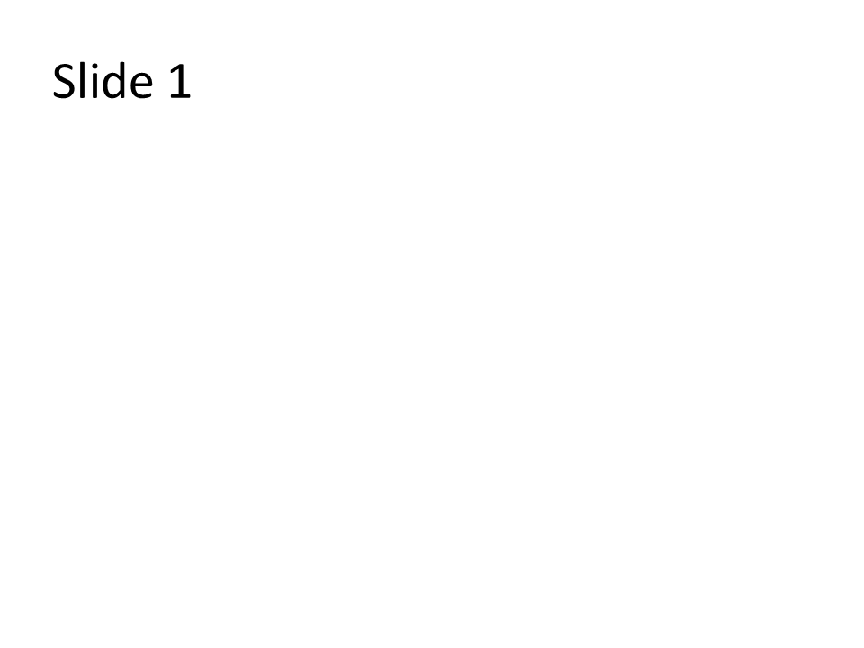

# Basic Generation (Python)

Build a deck from scratch with one slide and one shape.

## Code

```python
from gopptx import Presentation

with Presentation.new() as pres:
    pres.add_slide("Hello World")
    pres.add_shape(0, "rect", (1, 1, 2, 1), text="Basic Shape")
    pres.save("basic_generation.pptx")
```

## Run It

```bash
go run ./examples/01-basic-pptx-generation/basic_gen.go
```

## Artifacts

- Source: `examples/01-basic-pptx-generation/basic_gen.go`
- PPTX: [basic-generation.pptx](../assets/pptx/basic-generation.pptx)
- Screenshot:


