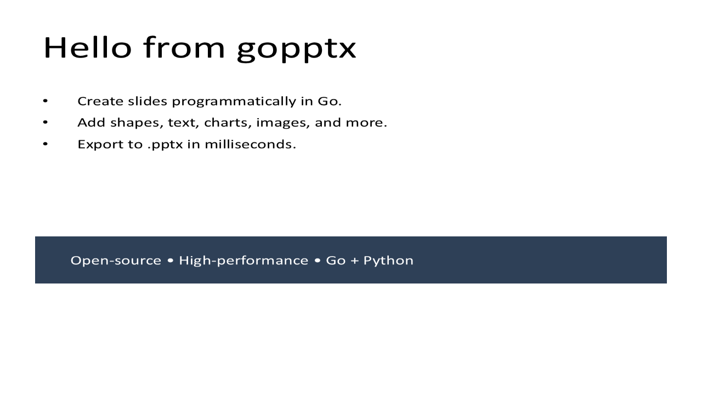

# Basic Usage

Create a polished first slide with title, bullets, and a highlighted call-out shape.

## Go Example

```go
package main

import (
	"os"
	"path/filepath"

	log "github.com/djinn-soul/gopptx/pkg/stdlog"

	"github.com/djinn-soul/gopptx/pkg/pptx"
	"github.com/djinn-soul/gopptx/pkg/pptx/shapes"
)

const outFile = "docs/assets/pptx/basic_usage.pptx"

func main() {
	if err := os.MkdirAll(filepath.Dir(outFile), 0o750); err != nil {
		log.Fatalf("create output dir: %v", err)
	}

	box := shapes.NewRectangle(0.5, 4.5, 9.0, 0.9).
		WithText("Open-source * High-performance * Go + Python").
		WithFill(shapes.NewShapeFill("2E4057"))

	slide := pptx.NewSlide("Hello from gopptx").
		AddBullet("Create slides programmatically in Go.").
		AddBullet("Add shapes, text, charts, images, and more.").
		AddBullet("Export to .pptx in milliseconds.").
		AddShape(box)

	if err := pptx.NewPresentationBuilder("gopptx - Basic Usage").
		AddSlide(slide).
		WriteToFile(outFile); err != nil {
		log.Fatalf("save: %v", err)
	}
	log.Printf("Saved %s", outFile)
}
```

## Run It

```bash
go run ./docs/code/basic_usage/
```

## Artifacts

- Source: `docs/code/basic_usage/main.go`
- PPTX: [basic_usage.pptx](../assets/pptx/basic_usage.pptx)
- Screenshot:


