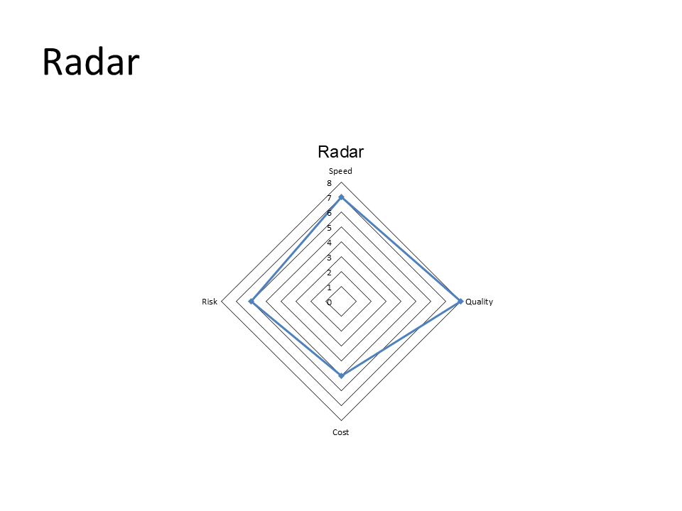

# Radar Chart

Generate a radar chart slide with category labels and multiple data points.

## Run It

```bash
go run ./examples/09-charts/chart_smoke.go
```

## Artifacts

- Source: `examples/09-charts/chart_smoke.go`
- PPTX: [chart-radar.pptx](../assets/pptx/chart-radar.pptx)
- Screenshot:

