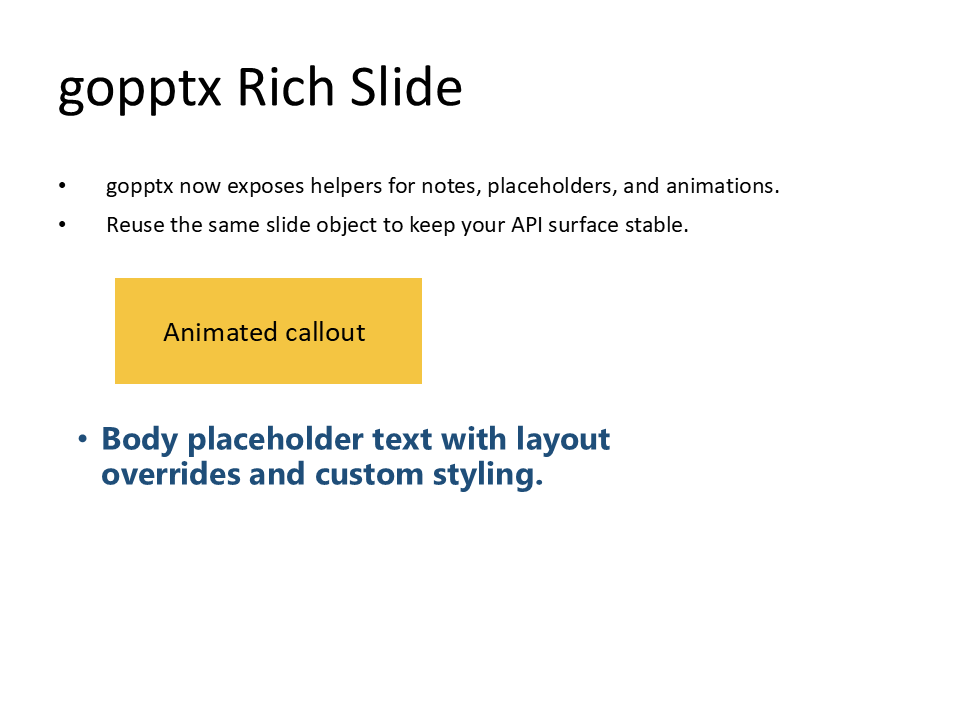

# Rich Slide

This example combines multiple capabilities on one slide:

- styled text and grouped content
- shape composition
- metadata/layout-aware content generation

## Run It

```bash
go run ./examples/58-gopptx-rich-slide/main.go
```

## Artifacts

- Source: `examples/58-gopptx-rich-slide/main.go`
- PPTX: [rich-slide.pptx](../assets/pptx/rich-slide.pptx)
- Screenshot:


