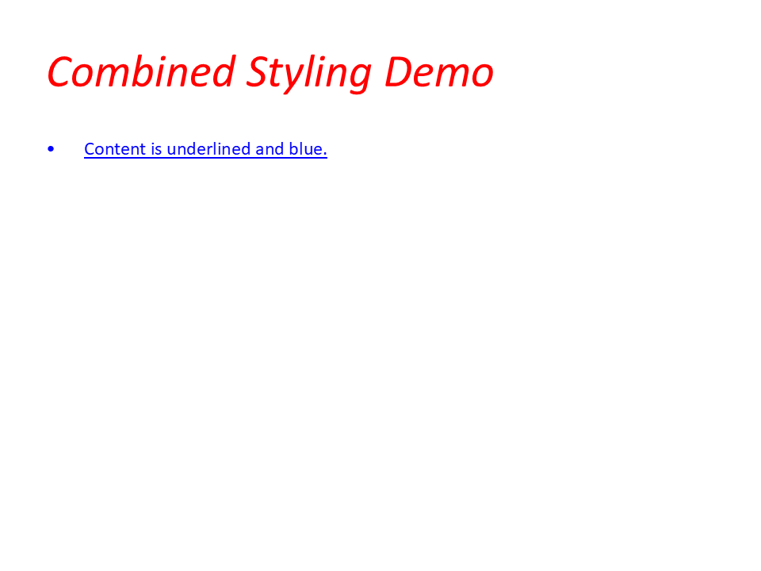

# Text Styling

Use this example to verify title/body formatting behavior: size, weight, color, underline, and paragraph spacing.

## Run It

```bash
go run ./examples/04-text-formatting/text_enhancements.go
```

## Artifacts

- Source: `examples/04-text-formatting/text_enhancements.go`
- PPTX: [text-styling.pptx](../assets/pptx/text-styling.pptx)
- Screenshot:

