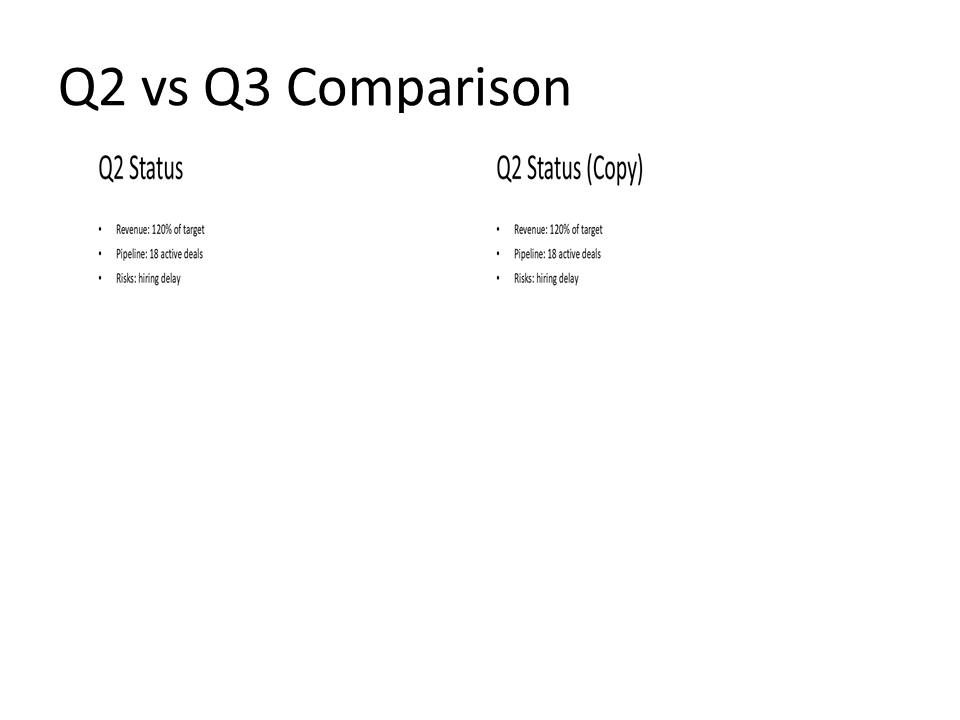
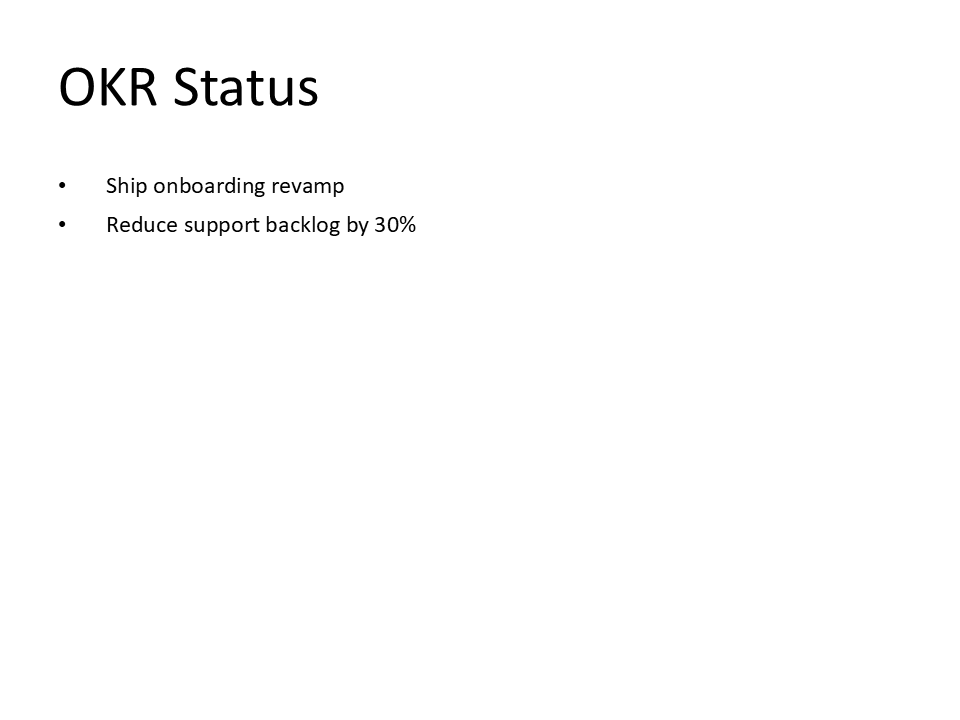
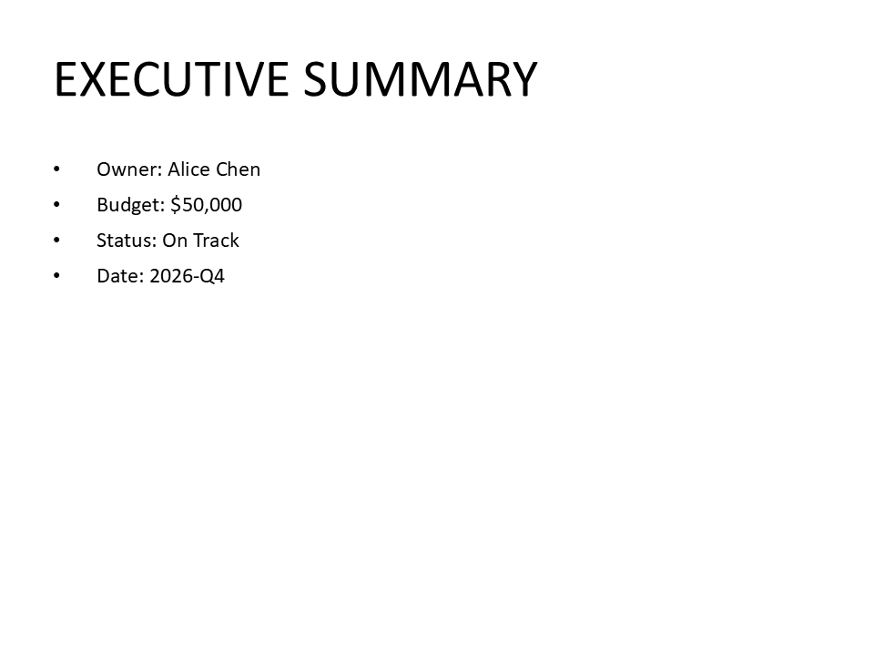
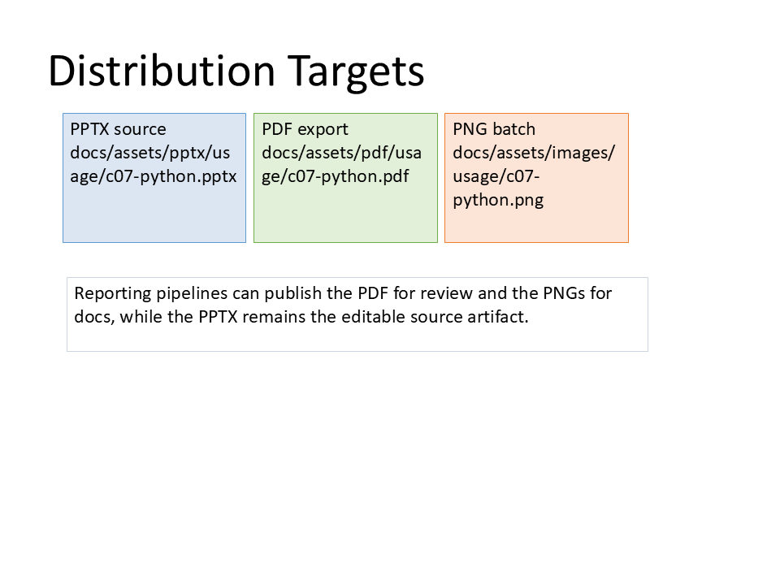
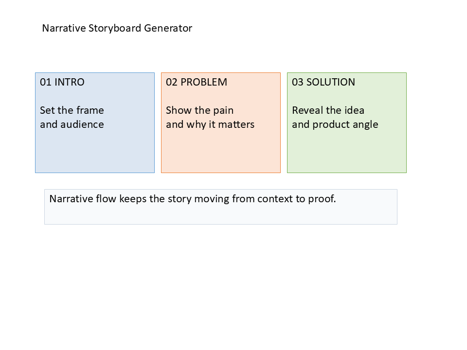
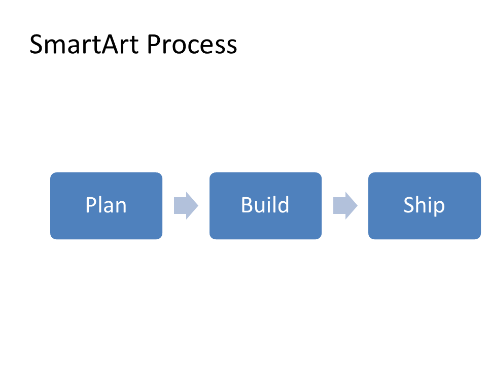

# Complex Usages (10)

Use these for enterprise-grade decks, template families, and automation pipelines.

Each usage is code-first and screenshot is generated from that Python code.

## C01 - Markdown + Mermaid Deck

**Focus:** Generate decks from markdown text specs with Mermaid diagrams.

**Go code**

```go
package main

import (
	"os"
	"path/filepath"

	"github.com/djinn-soul/gopptx/pkg/pptx"
)

func main() {
	markdownPath := filepath.Join("examples", "assets", "03", "markdown_mermaid_complex.md")
	slides, err := pptx.SlidesFromMarkdownFile(markdownPath)
	if err != nil {
		panic(err)
	}

	deck, err := pptx.CreateWithSlides("C01 Markdown + Mermaid Deck", slides)
	if err != nil {
		panic(err)
	}

	_ = os.WriteFile("c01-go.pptx", deck, 0o600)
}
```

**Python code**

```python
from pathlib import Path

from gopptx import Presentation

with Presentation.new("C01 Markdown + Mermaid Deck") as p:
    markdown_path = Path("examples/assets/03/markdown_mermaid_complex.md")
    p.add_slide_from_markdown(markdown_path.read_text(encoding="utf-8"))
    p.save("docs/assets/pptx/usage/c01-python.pptx")
```

**Download PPTX:** [c01-python.pptx](../../assets/pptx/usage/c01-python.pptx)

Screenshot generated from the Python code above using `export_pptx_png.ps1`.


## C02 - URL Fetch to Slides

**Focus:** Convert a real web page into slides.

**Go code**

```go
package main

import (
	"os"

	"github.com/djinn-soul/gopptx/pkg/pptx/urlfetch"
)

func main() {
	pptx, err := urlfetch.URLToPPTX("https://www.rfc-editor.org/rfc/rfc9110")
	if err != nil {
		panic(err)
	}
	_ = os.WriteFile("c02-go.pptx", pptx, 0o600)
}
```

**Python code**

```python
from gopptx import Presentation

with Presentation.new("C02 URL Fetch to Slides") as p:
    p.add_slide_from_url("https://www.rfc-editor.org/rfc/rfc9110")
    p.save("docs/assets/pptx/usage/c02-python.pptx")
```

**Download PPTX:** [c02-python.pptx](../../assets/pptx/usage/c02-python.pptx)

Screenshot generated from the Python code above using `export_pptx_png.ps1`.


## C03 - Code-to-Slide Rendering

**Focus:** Generate slides programmatically from structured input.

**Go code**

```go
package main

import (
	"github.com/djinn-soul/gopptx/pkg/pptx"
	"github.com/djinn-soul/gopptx/pkg/pptx/styling"
	"github.com/djinn-soul/gopptx/pkg/pptx/tables"
)

type SectionSpec struct {
	Kind    string
	Title   string
	Bullets []string
	Rows    [][]string
}

type DeckSpec struct {
	Title    string
	Subtitle string
	Sections []SectionSpec
}

func addCard(slide pptx.SlideContent, x, y, w, h float64, label, value, fill, line string) pptx.SlideContent {
	return slide.AddShape(
		pptx.NewRoundedRectangle(x, y, w, h).
			WithFill(pptx.NewShapeFill(fill)).
			WithLine(pptx.NewShapeLine(line, pptx.Points(1.0))).
			WithText(label + "\n" + value).
			WithAutoFit(pptx.TextAutoFitNormal),
	)
}

func buildCover(spec DeckSpec) pptx.SlideContent {
	slide := pptx.NewSlide("").WithBlankLayout().
		AddShape(pptx.NewTextBox(spec.Title, 0.8, 0.35, 6.8, 0.5).WithAutoFit(pptx.TextAutoFitNormal)).
		AddShape(pptx.NewTextBox(spec.Subtitle, 0.8, 0.82, 6.8, 0.32).WithAutoFit(pptx.TextAutoFitNormal))
	slide = addCard(slide, 0.8, 1.35, 1.9, 0.95, "Structured input", "JSON spec", "EEF4FB", "A9C4E2")
	slide = addCard(slide, 2.88, 1.35, 1.9, 0.95, "Renderer", "Switch on kind", "E8F5E9", "B8D5B8")
	slide = addCard(slide, 4.96, 1.35, 1.9, 0.95, "Output", "3 slides", "FCE4D6", "E8B89C")
	slide = slide.
		AddShape(
			pptx.NewRoundedRectangle(0.8, 2.55, 3.05, 2.45).
				WithFill(pptx.NewShapeFill("FFFFFF")).
				WithLine(pptx.NewShapeLine("C9D3E0", pptx.Points(1.0))),
		).
		AddShape(
			pptx.NewTextBox("Input schema\n\n- title\n- subtitle\n- sections[]\n- kind\n- bullets or rows", 1.02, 2.82, 2.6, 1.7).
				WithAutoFit(pptx.TextAutoFitNormal),
		).
		AddShape(
			pptx.NewRoundedRectangle(4.15, 2.55, 4.05, 2.45).
				WithFill(pptx.NewShapeFill("F8FBFF")).
				WithLine(pptx.NewShapeLine("C9D3E0", pptx.Points(1.0))),
		).
		AddShape(
			pptx.NewTextBox("Rendering flow\n\n1. Load structured input\n2. Render cover slide\n3. Map each section to a slide\n4. Save PPTX output", 4.4, 2.78, 3.5, 1.8).
				WithAutoFit(pptx.TextAutoFitNormal),
		).
		AddShape(
			pptx.NewTextBox("The same pattern works for JSON, Python dicts, or database query rows.", 0.8, 5.25, 8.0, 0.3).
				WithAutoFit(pptx.TextAutoFitNormal),
		)
	return slide
}

func main() {
	spec := DeckSpec{
		Title:    "Code-to-Slide Rendering",
		Subtitle: "Generate slides programmatically from structured input.",
		Sections: []SectionSpec{
			{
				Kind:  "bullets",
				Title: "Renderer Rules",
				Bullets: []string{
					"Read a JSON or dict payload",
					"Switch on section kind",
					"Emit slides in the declared order",
				},
			},
			{
				Kind:  "table",
				Title: "Metrics Snapshot",
				Rows: [][]string{
					{"Region", "Revenue", "Orders"},
					{"North", "460000", "128"},
					{"West", "370000", "102"},
					{"South", "290000", "96"},
				},
			},
		},
	}

	pres := pptx.NewPresentationBuilder(spec.Title).
		WithSlideSize(pptx.SlideSize16x9()).
		WithTheme(pptx.ThemeTech)
	pres.AddSlide(buildCover(spec))
	pres.AddBulletSlide(spec.Sections[0].Title, spec.Sections[0].Bullets)

	table := tables.NewTable([]styling.Length{
		styling.Inches(1.6), styling.Inches(1.6), styling.Inches(1.6),
	}).
		WithStyledData([][]tables.TableCell{
			{
				pptx.NewTableCell("Region").WithBold(true).WithBackgroundColor("2F6DE1").WithBorder(1, "FFFFFF"),
				pptx.NewTableCell("Revenue").WithBold(true).WithBackgroundColor("2F6DE1").WithBorder(1, "FFFFFF"),
				pptx.NewTableCell("Orders").WithBold(true).WithBackgroundColor("2F6DE1").WithBorder(1, "FFFFFF"),
			},
			{
				pptx.NewTableCell("North"),
				pptx.NewTableCell("460000"),
				pptx.NewTableCell("128"),
			},
			{
				pptx.NewTableCell("West"),
				pptx.NewTableCell("370000"),
				pptx.NewTableCell("102"),
			},
			{
				pptx.NewTableCell("South"),
				pptx.NewTableCell("290000"),
				pptx.NewTableCell("96"),
			},
		}).
		Position(styling.Inches(0.8), styling.Inches(1.35)).
		Size(styling.Inches(6.6), styling.Inches(2.7))

	tableSlide := pptx.NewSlide(spec.Sections[1].Title).WithBlankLayout().
		AddShape(pptx.NewTextBox(spec.Sections[1].Title, 0.8, 0.35, 6.4, 0.45).WithAutoFit(pptx.TextAutoFitNormal)).
		AddShape(pptx.NewTextBox("Table rows can be sourced from CSV files or SQL query results.", 0.8, 4.35, 6.8, 0.3).WithAutoFit(pptx.TextAutoFitNormal)).
		WithTable(table)
	pres.AddSlide(tableSlide)
	_ = pres.WriteToFile("c03-go.pptx")
}
```

**Python code**

```python
from __future__ import annotations

import json

from gopptx import Presentation, ShapeType
from gopptx.constants import SIZE_16X9_HEIGHT, SIZE_16X9_WIDTH
from gopptx.presentation.theme import get_theme
from gopptx.schemas import Inches

DECK_JSON = """
{
  "title": "Code-to-Slide Rendering",
  "subtitle": "Generate slides programmatically from structured input.",
  "sections": [
    {
      "kind": "bullets",
      "title": "Renderer Rules",
      "bullets": [
        "Read a JSON or dict payload",
        "Switch on section kind",
        "Emit slides in the declared order"
      ]
    },
    {
      "kind": "table",
      "title": "Metrics Snapshot",
      "rows": [
        ["Region", "Revenue", "Orders"],
        ["North", "460000", "128"],
        ["West", "370000", "102"],
        ["South", "290000", "96"]
      ]
    }
  ]
}
"""


def load_spec() -> dict[str, object]:
    return json.loads(DECK_JSON)


def add_card(slide, x: float, y: float, w: float, h: float, label: str, value: str, fill: str, line: str) -> None:
    slide.add_shape(
        ShapeType.ROUNDED_RECTANGLE,
        (Inches(x), Inches(y), Inches(w), Inches(h)),
        text=f"{label}\n{value}",
        properties={
            "fill": {"solid": fill},
            "line": {"color": line, "width_emu": 12700},
        },
    )


def render_cover(slide, spec: dict[str, object], section_count: int) -> None:
    slide.add_textbox(Inches(0.8), Inches(0.35), Inches(6.8), Inches(0.5), text=str(spec["title"]))
    slide.add_textbox(Inches(0.8), Inches(0.82), Inches(6.8), Inches(0.32), text=str(spec["subtitle"]))
    add_card(slide, 0.8, 1.35, 1.9, 0.95, "Structured input", "JSON spec", "EEF4FB", "A9C4E2")
    add_card(slide, 2.88, 1.35, 1.9, 0.95, "Renderer", "Switch on kind", "E8F5E9", "B8D5B8")
    add_card(slide, 4.96, 1.35, 1.9, 0.95, "Output", f"{section_count + 1} slides", "FCE4D6", "E8B89C")

    slide.add_shape(
        ShapeType.ROUNDED_RECTANGLE,
        (Inches(0.8), Inches(2.55), Inches(3.05), Inches(2.45)),
        properties={
            "fill": {"solid": "FFFFFF"},
            "line": {"color": "C9D3E0", "width_emu": 12700},
        },
    )
    slide.add_textbox(
        Inches(1.02),
        Inches(2.82),
        Inches(2.6),
        Inches(1.7),
        text="Input schema\n\n- title\n- subtitle\n- sections[]\n- kind\n- bullets or rows",
    )

    slide.add_shape(
        ShapeType.ROUNDED_RECTANGLE,
        (Inches(4.15), Inches(2.55), Inches(4.05), Inches(2.45)),
        properties={
            "fill": {"solid": "F8FBFF"},
            "line": {"color": "C9D3E0", "width_emu": 12700},
        },
    )
    slide.add_textbox(
        Inches(4.4),
        Inches(2.78),
        Inches(3.5),
        Inches(1.8),
        text=(
            "Rendering flow\n\n"
            "1. Load structured input\n"
            "2. Render cover slide\n"
            "3. Map each section to a slide\n"
            "4. Save PPTX output"
        ),
    )
    slide.add_textbox(
        Inches(0.8),
        Inches(5.25),
        Inches(8.0),
        Inches(0.3),
        text="The same pattern works for JSON, Python dicts, or database query rows.",
    )


spec = load_spec()
sections = list(spec["sections"])

with Presentation.new(str(spec["title"])) as p:
    p.set_slide_size(SIZE_16X9_WIDTH, SIZE_16X9_HEIGHT)
    p.apply_theme(get_theme("ocean"))
    p.update_slide(0, layout="blank")
    render_cover(p.slides[0], spec, len(sections))

    p.add_bullet_slide(str(sections[0]["title"]), [str(item) for item in sections[0]["bullets"]])

    p.add_slide(str(sections[1]["title"]), layout="blank")
    p.update_slide(2, layout="blank")
    table_slide = p.slides[2]
    table_slide.add_textbox(
        Inches(0.8),
        Inches(0.35),
        Inches(6.4),
        Inches(0.45),
        text=str(sections[1]["title"]),
    )
    p.add_table(
        slide=2,
        rows=4,
        cols=3,
        bounds=(Inches(0.8), Inches(1.35), Inches(6.6), Inches(2.7)),
        data=[[str(cell) for cell in row] for row in sections[1]["rows"]],
        first_row=True,
        band_row=True,
    )
    table_slide.add_textbox(
        Inches(0.8),
        Inches(4.35),
        Inches(6.8),
        Inches(0.3),
        text="Table rows can be sourced from CSV files or SQL query results.",
    )
    p.save("docs/assets/pptx/usage/c03-python.pptx")
```

**Download PPTX:** [c03-python.pptx](../../assets/pptx/usage/c03-python.pptx)

Screenshot generated from the code above using `export_pptx_png.ps1`.


## C04 - Clone / Duplicate Slide Content

**Focus:** Reuse slide structure with changed data.

**Go code**

```go
package main

import (
	"fmt"
	"os"
	"path/filepath"

	"github.com/djinn-soul/gopptx/pkg/pptx"
	"github.com/djinn-soul/gopptx/pkg/pptx/styling"
	"github.com/djinn-soul/gopptx/pkg/pptx/shapes"
)

func main() {
	workDir, err := os.MkdirTemp("", "c04_clone_")
	if err != nil {
		panic(fmt.Errorf("create temp dir: %w", err))
	}
	defer func() { _ = os.RemoveAll(workDir) }()

	basePath := filepath.Join(workDir, "c04_clone_base.pptx")
	exportDir := filepath.Join(workDir, "c04_clone_export")
	finalPath := filepath.Join("docs", "assets", "pptx", "usage", "c04-python.pptx")

	original := pptx.NewSlide("Q2 Status").
		AddBullet("Revenue: 120% of target").
		AddBullet("Pipeline: 18 active deals").
		AddBullet("Risks: hiring delay")
	if err := pptx.WriteFile(basePath, "C04 Clone / Duplicate Slide Content", []pptx.SlideContent{original}); err != nil {
		panic(fmt.Errorf("create base deck: %w", err))
	}

	editor, err := pptx.OpenPresentationEditor(basePath)
	if err != nil {
		panic(fmt.Errorf("open editor: %w", err))
	}
	defer func() { _ = editor.Close() }()

	cloneIdx, err := editor.DuplicateSlideAfter(0)
	if err != nil {
		panic(fmt.Errorf("duplicate slide: %w", err))
	}

	comparison := pptx.NewSlide("Q2 vs Q3 Comparison").WithTitleOnlyLayout().
		AddImage(shapes.NewImage(filepath.Join(exportDir, "Slide1.PNG"), styling.Inches(0.8), styling.Inches(1.18), styling.Inches(3.7), styling.Inches(4.7))).
		AddImage(shapes.NewImage(filepath.Join(exportDir, "Slide2.PNG"), styling.Inches(4.95), styling.Inches(1.18), styling.Inches(3.7), styling.Inches(4.7)))

	finalSlides := []pptx.SlideContent{
		original,
		pptx.NewSlide("Q2 Status").
			AddBullet("Revenue: 120% of target").
			AddBullet("Pipeline: 18 active deals").
			AddBullet("Risks: hiring delay"),
		comparison,
	}
	if err := pptx.WriteFile(finalPath, "C04 Clone / Duplicate Slide Content", finalSlides); err != nil {
		panic(fmt.Errorf("write final deck: %w", err))
	}
}
```

**Python code**

```python
from tempfile import TemporaryDirectory

from gopptx import Presentation

with TemporaryDirectory(prefix="c04_clone_") as workdir:
    base_path = os.path.join(workdir, "c04_clone_base.pptx")
    export_dir = os.path.join(workdir, "c04_clone_export")

    with Presentation.new("C04 Clone / Duplicate Slide Content") as p:
        p.remove_slide(0)
        p.add_bullet_slide(
            "Q2 Status",
            [
                "Revenue: 120% of target",
                "Pipeline: 18 active deals",
                "Risks: hiring delay",
            ],
        )
        p.duplicate_slide_after(0)
        p.save(base_path)

    with Presentation.new("C04 Clone / Duplicate Slide Content") as p:
        p.remove_slide(0)
        p.add_bullet_slide(
            "Q2 Status",
            [
                "Revenue: 120% of target",
                "Pipeline: 18 active deals",
                "Risks: hiring delay",
            ],
        )
        p.duplicate_slide_after(0)
        compare = p.add_slide("Q2 vs Q3 Comparison", layout="title_only")
        compare.add_image(os.path.join(export_dir, "Slide1.PNG"), (0.8, 1.18, 3.7, 4.7))
        compare.add_image(os.path.join(export_dir, "Slide2.PNG"), (4.95, 1.18, 3.7, 4.7))
        p.save(os.path.join(workdir, "c04-python.pptx"))
```

**Download PPTX:** [c04-python.pptx](../../assets/pptx/usage/c04-python.pptx)

Screenshot generated from the Python code above using `export_pptx_png.ps1`.



## C05 - Template + Data Injection System

**Focus:** Fill pre-designed templates using dynamic data.

**Go code**

```go
package main

import (
	"os"

	"github.com/djinn-soul/gopptx/pkg/pptx"
)

func main() {
	slides, err := pptx.StatusTemplate{
		Project: "Q4 Launch Readiness",
		OKRs: []string{
			"Ship onboarding revamp",
			"Reduce support backlog by 30%",
		},
		Risks: []string{
			"Legal review pending",
			"Final content freeze is not approved",
		},
		NextSteps: []string{
			"Approve final copy",
			"Schedule rollout",
			"Notify customer success",
		},
		Branding: pptx.BrandingSpec{Preset: pptx.PresetCreative},
	}.Build()
	if err != nil {
		panic(err)
	}

	deck, err := pptx.CreateWithSlides("Q4 Launch Readiness - Status Update", slides)
	if err != nil {
		panic(err)
	}

	_ = os.WriteFile("output.pptx", deck, 0o600)
}
```

**Python code**

```python
from gopptx.templates import StatusTemplate
from gopptx.presentation.theme import get_theme


prs = StatusTemplate(
    project="Q4 Launch Readiness",
    okrs=[
        "Ship onboarding revamp",
        "Reduce support backlog by 30%",
    ],
    risks=[
        "Legal review pending",
        "Final content freeze is not approved",
    ],
    next_steps=[
        "Approve final copy",
        "Schedule rollout",
        "Notify customer success",
    ],
    theme=get_theme("aurora"),
).build()
prs.save("output.pptx")
```

**Download PPTX:** [c05-python.pptx](../../assets/pptx/usage/c05-python.pptx)

Screenshot generated from the Python code above using `export_pptx_png.ps1`.



## C06 - Jinja2 Template Rendering

**Focus:** Embed `{{ variable }}` and `{{ variable | filter }}` tags directly inside a `.pptx` file and render them with your data — no external template engine wiring needed.

**Go code**

```go
package main

import (
	"fmt"
	"os"

	"github.com/djinn-soul/gopptx/pkg/pptx"
	"github.com/djinn-soul/gopptx/pkg/pptx/editor"
)

func main() {
	// Step 1: build a .pptx template with Jinja2 {{ ... }} tags in shapes.
	templateSlides := []pptx.SlideContent{
		pptx.NewSlide("{{ title }}").
			AddBullet("Owner: {{ owner }}").
			AddBullet("Budget: {{ budget }}").
			AddBullet("Status: {{ status }}"),
		pptx.NewSlide("{{ section | upper }}").
			AddBullet("Date: {{ date }}").
			AddBullet("Risk: {{ risk | default('None') }}"),
	}
	tmp, err := os.CreateTemp("", "gopptx-c06-*.pptx")
	if err != nil {
		panic(err)
	}
	tmpPath := tmp.Name()
	_ = tmp.Close()
	defer os.Remove(tmpPath)

	if err = pptx.WriteFile(tmpPath, "Template", templateSlides); err != nil {
		panic(err)
	}

	// Step 2: open and render — tags replaced in-place, run formatting preserved.
	e, err := editor.FromTemplate(tmpPath, map[string]any{
		"title":   "Q4 Launch Proposal",
		"section": "executive summary", // | upper → EXECUTIVE SUMMARY
		"owner":   "Alice Chen",
		"budget":  "$50,000",
		"status":  "On Track",
		"date":    "2026-Q4",
	})
	if err != nil {
		panic(err)
	}
	defer e.Close()

	if err = e.Save("output.pptx"); err != nil {
		panic(err)
	}
	fmt.Println("Rendered presentation saved to output.pptx")
}
```

**Python code**

```python
import tempfile
import os

from gopptx import Presentation

# Step 1: build a .pptx template with Jinja2 {{ ... }} tags in shapes.
tpl = Presentation.new("{{ title }}")
tpl.add_bullet_slide(
    "{{ section | upper }}",
    [
        "Owner: {{ owner }}",
        "Budget: {{ budget }}",
        "Status: {{ status }}",
        "Date: {{ date }}",
    ],
)
tmp = tempfile.NamedTemporaryFile(suffix=".pptx", delete=False)
tmp_path = tmp.name
tmp.close()
tpl.save(tmp_path)
tpl.close()

# Step 2: open and render — tags replaced in-place, run formatting preserved.
try:
    prs = Presentation.from_template(
        tmp_path,
        context={
            "title":   "Q4 Launch Proposal",
            "section": "executive summary",  # | upper → EXECUTIVE SUMMARY
            "owner":   "Alice Chen",
            "budget":  "$50,000",
            "status":  "On Track",
            "date":    "2026-Q4",
        },
    )
    prs.save("docs/assets/pptx/usage/c06-python.pptx")
    prs.close()
finally:
    os.unlink(tmp_path)
```

**Download PPTX:** [c06-python.pptx](../../assets/pptx/usage/c06-python.pptx)

Screenshot generated from the Python code above using `export_pptx_png.ps1`.



## C07 - Export & Distribution Pipeline

**Focus:** Batch-export PPTX to PNG and PDF for reporting pipelines and CI/CD artifacts.

**Go code**

```go
package main

import (
    "os"
    "os/exec"
    "path/filepath"

    "github.com/djinn-soul/gopptx/pkg/pptx"
    "github.com/djinn-soul/gopptx/pkg/pptx/export"
)

func buildPipelineSlide() pptx.SlideContent {
    slide := pptx.NewSlide("Export & Distribution Pipeline")
    slide = slide.AddShape(pptx.NewRoundedRectangle(0.75, 1.55, 2.4, 1.12).
        WithText("Build PPTX\nquarterly_report.pptx").
        WithFill(pptx.NewShapeFill("D9EAF7")).
        WithLine(pptx.NewShapeLine("4A86B8", pptx.Points(1))))
    slide = slide.AddShape(pptx.NewRoundedRectangle(3.45, 1.55, 2.4, 1.12).
        WithText("Export PDF\nquarterly_report.pdf").
        WithFill(pptx.NewShapeFill("E2F0D9")).
        WithLine(pptx.NewShapeLine("5F8C5A", pptx.Points(1))))
    slide = slide.AddShape(pptx.NewRoundedRectangle(6.15, 1.55, 2.4, 1.12).
        WithText("Batch PNG\nslide_*.png").
        WithFill(pptx.NewShapeFill("FCE4D6")).
        WithLine(pptx.NewShapeLine("C27A2C", pptx.Points(1))))
    slide = slide.AddConnector(pptx.NewStraightConnector(3.17, 2.1, 3.38, 2.1).
        WithLine(pptx.NewShapeLine("64748B", pptx.Points(1.5))))
    slide = slide.AddConnector(pptx.NewStraightConnector(5.87, 2.1, 6.08, 2.1).
        WithLine(pptx.NewShapeLine("64748B", pptx.Points(1.5))))
    slide = slide.AddShape(pptx.NewRoundedRectangle(0.95, 3.25, 7.55, 1.0).
        WithText("CI/CD friendly: generate one PPTX, archive a PDF, and publish all slide PNGs as build artifacts.").
        WithFill(pptx.NewShapeFill("F8FAFC")).
        WithLine(pptx.NewShapeLine("CBD5E1", pptx.Points(1))))
    return slide
}

func buildTargetsSlide() pptx.SlideContent {
    slide := pptx.NewSlide("Distribution Targets")
    slide = slide.AddShape(pptx.NewRoundedRectangle(0.8, 1.45, 2.35, 1.65).
        WithText("PPTX source\ndocs/assets/pptx/usage/c07-python.pptx").
        WithFill(pptx.NewShapeFill("DCE6F2")).
        WithLine(pptx.NewShapeLine("5B9BD5", pptx.Points(1))))
    slide = slide.AddShape(pptx.NewRoundedRectangle(3.25, 1.45, 2.35, 1.65).
        WithText("PDF export\ndocs/assets/pdf/usage/c07-python.pdf").
        WithFill(pptx.NewShapeFill("E2F0D9")).
        WithLine(pptx.NewShapeLine("70AD47", pptx.Points(1))))
    slide = slide.AddShape(pptx.NewRoundedRectangle(5.7, 1.45, 2.35, 1.65).
        WithText("PNG batch\ndocs/assets/images/usage/c07-python.png").
        WithFill(pptx.NewShapeFill("FCE4D6")).
        WithLine(pptx.NewShapeLine("ED7D31", pptx.Points(1))))
    slide = slide.AddShape(pptx.NewRoundedRectangle(0.85, 3.55, 7.45, 0.95).
        WithText("Reporting pipelines can publish the PDF for review and the PNGs for docs, while the PPTX remains the editable source artifact.").
        WithFill(pptx.NewShapeFill("FFFFFF")).
        WithLine(pptx.NewShapeLine("CBD5E1", pptx.Points(1))))
    return slide
}

func main() {
    deckPath := filepath.Join("docs", "assets", "pptx", "usage", "c07-python.pptx")
    pdfPath := filepath.Join("docs", "assets", "pdf", "usage", "c07-python.pdf")
    pngDir, err := os.MkdirTemp("", "gopptx-c07-png-")
    if err != nil {
        panic(err)
    }
    defer os.RemoveAll(pngDir)

    deck, err := pptx.CreateWithSlides("C07 Export & Distribution Pipeline", []pptx.SlideContent{buildPipelineSlide(), buildTargetsSlide()})
    if err != nil {
        panic(err)
    }
    if err := os.WriteFile(deckPath, deck, 0o600); err != nil {
        panic(err)
    }
    if err := export.PDFFromFileWithOptions(deckPath, pdfPath, export.PDFOptions{Driver: export.PDFDriverNative}); err != nil {
        panic(err)
    }
    if err := exec.Command("powershell", "-ExecutionPolicy", "Bypass", "-File", "scripts/tools/visual_regression/export_pptx_png.ps1", "-PptxPath", deckPath, "-OutDir", pngDir).Run(); err != nil {
        panic(err)
    }
}
```

**Python code**

```python
from pathlib import Path

from gopptx import ConnectorType, Presentation, ShapeType
from gopptx.presentation.export.export_mixin import PDFOptions
from gopptx.schemas import Inches


def build_pipeline_slide(slide):
    slide.add_shape(
        ShapeType.ROUNDED_RECTANGLE,
        (Inches(0.75), Inches(1.55), Inches(2.4), Inches(1.12)),
        text="Build PPTX\nquarterly_report.pptx",
        properties={"fill": {"solid": "D9EAF7"}, "line": {"color": "4A86B8", "width_emu": 12700}},
    )
    slide.add_shape(
        ShapeType.ROUNDED_RECTANGLE,
        (Inches(3.45), Inches(1.55), Inches(2.4), Inches(1.12)),
        text="Export PDF\nquarterly_report.pdf",
        properties={"fill": {"solid": "E2F0D9"}, "line": {"color": "5F8C5A", "width_emu": 12700}},
    )
    slide.add_shape(
        ShapeType.ROUNDED_RECTANGLE,
        (Inches(6.15), Inches(1.55), Inches(2.4), Inches(1.12)),
        text="Batch PNG\nslide_*.png",
        properties={"fill": {"solid": "FCE4D6"}, "line": {"color": "C27A2C", "width_emu": 12700}},
    )
    slide.add_connector(ConnectorType.STRAIGHT, Inches(3.17), Inches(2.1), Inches(3.38), Inches(2.1), properties={"line": {"color": "64748B", "width_emu": 19050}})
    slide.add_connector(ConnectorType.STRAIGHT, Inches(5.87), Inches(2.1), Inches(6.08), Inches(2.1), properties={"line": {"color": "64748B", "width_emu": 19050}})
    slide.add_shape(
        ShapeType.ROUNDED_RECTANGLE,
        (Inches(0.95), Inches(3.25), Inches(7.55), Inches(1.0)),
        text="CI/CD friendly: generate one PPTX, archive a PDF, and publish all slide PNGs as build artifacts.",
        properties={"fill": {"solid": "F8FAFC"}, "line": {"color": "CBD5E1", "width_emu": 12700}},
    )


def build_targets_slide(slide):
    slide.add_shape(
        ShapeType.ROUNDED_RECTANGLE,
        (Inches(0.8), Inches(1.45), Inches(2.35), Inches(1.65)),
        text="PPTX source\ndocs/assets/pptx/usage/c07-python.pptx",
        properties={"fill": {"solid": "DCE6F2"}, "line": {"color": "5B9BD5", "width_emu": 12700}},
    )
    slide.add_shape(
        ShapeType.ROUNDED_RECTANGLE,
        (Inches(3.25), Inches(1.45), Inches(2.35), Inches(1.65)),
        text="PDF export\ndocs/assets/pdf/usage/c07-python.pdf",
        properties={"fill": {"solid": "E2F0D9"}, "line": {"color": "70AD47", "width_emu": 12700}},
    )
    slide.add_shape(
        ShapeType.ROUNDED_RECTANGLE,
        (Inches(5.7), Inches(1.45), Inches(2.35), Inches(1.65)),
        text="PNG batch\ndocs/assets/images/usage/c07-python.png",
        properties={"fill": {"solid": "FCE4D6"}, "line": {"color": "ED7D31", "width_emu": 12700}},
    )
    slide.add_shape(
        ShapeType.ROUNDED_RECTANGLE,
        (Inches(0.85), Inches(3.55), Inches(7.45), Inches(0.95)),
        text="Reporting pipelines can publish the PDF for review and the PNGs for docs, while the PPTX remains the editable source artifact.",
        properties={"fill": {"solid": "FFFFFF"}, "line": {"color": "CBD5E1", "width_emu": 12700}},
    )


repo = Path.cwd()
pptx_path = repo / "docs" / "assets" / "pptx" / "usage" / "c07-python.pptx"
pdf_path = repo / "docs" / "assets" / "pdf" / "usage" / "c07-python.pdf"
pptx_path.parent.mkdir(parents=True, exist_ok=True)
pdf_path.parent.mkdir(parents=True, exist_ok=True)
with Presentation.new("C07 Export & Distribution Pipeline") as p:
    build_pipeline_slide(p.slides[0])
    build_targets_slide(p.add_slide("Distribution Targets"))
    p.save(str(pptx_path))
    p.save_as_pdf(str(pdf_path), options=PDFOptions(driver="native"))
```

**Download PPTX:** [c07-python.pptx](../../assets/pptx/usage/c07-python.pptx)

**Download PDF:** [c07-python.pdf](../../assets/pdf/usage/c07-python.pdf)

Screenshot generated from the Python code above using `export_pptx_png.ps1`.



## C08 - Narrative Storyboard Generator

**Focus:** Build structured storytelling slides: Intro -> Problem -> Solution -> Data.

**Go code**

```go
package main

import (
    "os"

    "github.com/djinn-soul/gopptx/pkg/pptx"
    "github.com/djinn-soul/gopptx/pkg/pptx/export"
)

func addChapterCard(slide pptx.SlideContent, title, body, fill, line string, x float64) pptx.SlideContent {
    return slide.AddShape(
        pptx.NewRoundedRectangle(x, 1.55, 2.55, 2.15).
            WithText(title + "\n\n" + body).
            WithFill(pptx.NewShapeFill(fill)).
            WithLine(pptx.NewShapeLine(line, pptx.Points(1))),
    )
}

func buildIntroSlide() pptx.SlideContent {
    slide := pptx.NewSlide("Narrative Storyboard Generator").WithBlankLayout()
    slide = slide.AddShape(pptx.NewTextBox("Narrative Storyboard Generator", 0.8, 0.4, 8.4, 0.45))
    slide = addChapterCard(slide, "01 INTRO", "Set the frame\nand audience", "DCE6F2", "5B9BD5", 0.75)
    slide = addChapterCard(slide, "02 PROBLEM", "Show the pain\nand why it matters", "FCE4D6", "ED7D31", 3.45)
    slide = addChapterCard(slide, "03 SOLUTION", "Reveal the idea\nand product angle", "E2F0D9", "70AD47", 6.15)
    slide = slide.AddShape(pptx.NewRoundedRectangle(0.95, 4.05, 7.55, 0.75).
        WithText("Narrative flow keeps the story moving from context to proof.").
        WithFill(pptx.NewShapeFill("F8FAFC")).
        WithLine(pptx.NewShapeLine("CBD5E1", pptx.Points(1))))
    return slide
}

func buildDataSlide() pptx.SlideContent {
    slide := pptx.NewSlide("Narrative Storyboard Generator").WithBlankLayout()
    slide = slide.AddShape(pptx.NewTextBox("Data Proof", 0.8, 0.4, 4.0, 0.45))
    slide = addChapterCard(slide, "Audience", "Target buyers\nand stakeholders", "EEF4FB", "A9C4E2", 0.75)
    slide = addChapterCard(slide, "Evidence", "Adoption trend\n+ conversion lift", "E8F5E9", "B8D5B8", 3.45)
    slide = addChapterCard(slide, "Outcome", "Revenue impact\nand launch readiness", "FFF2CC", "D6B656", 6.15)
    slide = slide.AddShape(pptx.NewRoundedRectangle(0.95, 4.05, 7.55, 0.75).
        WithText("Use the same structure to keep pitch decks and product stories consistent.").
        WithFill(pptx.NewShapeFill("FFFFFF")).
        WithLine(pptx.NewShapeLine("CBD5E1", pptx.Points(1))))
    return slide
}

func main() {
    deck, err := pptx.CreateWithSlides("C08 Narrative Storyboard Generator", []pptx.SlideContent{
        buildIntroSlide(),
        buildDataSlide(),
    })
    if err != nil {
        panic(err)
    }
    if err := os.WriteFile("docs/assets/pptx/usage/c08-python.pptx", deck, 0o600); err != nil {
        panic(err)
    }
}
```

**Python code**

```python
from gopptx import Presentation, ShapeType
from gopptx.presentation.slides import SlideLayoutType
from gopptx.schemas import Inches


def add_chapter_card(slide, title, body, fill, line, x):
    slide.add_shape(
        ShapeType.ROUNDED_RECTANGLE,
        (Inches(x), Inches(1.55), Inches(2.55), Inches(2.15)),
        text=f"{title}\n\n{body}",
        properties={"fill": {"solid": fill}, "line": {"color": line, "width_emu": 12700}},
    )


def build_intro_slide(slide):
    slide.add_textbox(Inches(0.8), Inches(0.4), Inches(8.4), Inches(0.45), text="Narrative Storyboard Generator")
    add_chapter_card(slide, "01 INTRO", "Set the frame\nand audience", "DCE6F2", "5B9BD5", 0.75)
    add_chapter_card(slide, "02 PROBLEM", "Show the pain\nand why it matters", "FCE4D6", "ED7D31", 3.45)
    add_chapter_card(slide, "03 SOLUTION", "Reveal the idea\nand product angle", "E2F0D9", "70AD47", 6.15)
    slide.add_shape(
        ShapeType.ROUNDED_RECTANGLE,
        (Inches(0.95), Inches(4.05), Inches(7.55), Inches(0.75)),
        text="Narrative flow keeps the story moving from context to proof.",
        properties={"fill": {"solid": "F8FAFC"}, "line": {"color": "CBD5E1", "width_emu": 12700}},
    )


def build_data_slide(slide):
    slide.add_textbox(Inches(0.8), Inches(0.4), Inches(4.0), Inches(0.45), text="Data Proof")
    add_chapter_card(slide, "Audience", "Target buyers\nand stakeholders", "EEF4FB", "A9C4E2", 0.75)
    add_chapter_card(slide, "Evidence", "Adoption trend\n+ conversion lift", "E8F5E9", "B8D5B8", 3.45)
    add_chapter_card(slide, "Outcome", "Revenue impact\nand launch readiness", "FFF2CC", "D6B656", 6.15)
    slide.add_shape(
        ShapeType.ROUNDED_RECTANGLE,
        (Inches(0.95), Inches(4.05), Inches(7.55), Inches(0.75)),
        text="Use the same structure to keep pitch decks and product stories consistent.",
        properties={"fill": {"solid": "FFFFFF"}, "line": {"color": "CBD5E1", "width_emu": 12700}},
    )


with Presentation.new("C08 Narrative Storyboard Generator") as p:
    p.update_slide(0, layout=SlideLayoutType.BLANK)
    build_intro_slide(p.slides[0])
    build_data_slide(p.add_slide("Narrative Storyboard Generator", layout=SlideLayoutType.BLANK))
    p.save("docs/assets/pptx/usage/c08-python.pptx")
```

**Download PPTX:** [c08-python.pptx](../../assets/pptx/usage/c08-python.pptx)

Screenshot generated from the Python code above using `export_pptx_png.ps1`.



## C09 - SmartArt Layouts

**Focus:** Insert native SmartArt diagrams (Process, Cycle, Hierarchy).

**Go code**

```go
package main

import (
	"github.com/djinn-soul/gopptx/pkg/gopptx"
	"github.com/djinn-soul/gopptx/pkg/pptx/smartart"
)

func main() {
	pres := &gopptx.Presentation{Title: "C09 SmartArt Layouts"}
	slide := pres.AddSlide()
	slide.Title = "SmartArt Process"

	sa := smartart.NewSmartArt(smartart.BasicProcess).
		Position(1.0, 2.0).
		Size(8.0, 3.0).
		AddItems([]string{"Plan", "Build", "Ship"})

	slide.AddSmartArt(sa)

	_ = pres.Save("c09-go.pptx")
}
```

**Python code**

```python
from gopptx import Presentation
from gopptx.smartart import SMARTART_BASIC_PROCESS
from gopptx.schemas import Inches

with Presentation.new("C09 SmartArt Layouts") as p:
    slide = p.add_slide("SmartArt Process")
    slide.add_smartart(
        SMARTART_BASIC_PROCESS,
        ["Plan", "Build", "Ship"],
        (1.0, 2.0, 8.0, 3.0),
    )
    p.save("docs/assets/pptx/usage/c09-python.pptx")
```

**Download PPTX:** [c09-python.pptx](../../assets/pptx/usage/c09-python.pptx)

Screenshot generated from the Python code above using `export_pptx_png.ps1`.



## C10 - Presentation Protection

**Focus:** Apply security settings like write-passwords and "Mark as Final" flags.

**Go code**

```go
package main

import (
	"github.com/djinn-soul/gopptx/pkg/pptx"
)

func main() {
	builder := pptx.NewPresentationBuilder("C10 Protected Presentation")
	builder.AddTitleSlide("Confidential")

	builder.WithModifyPassword("secret").
		WithMarkAsFinal(true)

	_ = builder.WriteToFile("c10-go.pptx")
}
```

**Python code**

```python
from gopptx import PresentationBuilder

with PresentationBuilder("C10 Protected Presentation") as b:
    b.add_title_slide("Confidential")
    b.with_modify_password("secret")
    b.with_mark_as_final(True)
    b.save("docs/assets/pptx/usage/c10-python.pptx")
```

**Download PPTX:** [c10-python.pptx](../../assets/pptx/usage/c10-python.pptx)

Screenshot generated from the Python code above using `export_pptx_png.ps1`.


