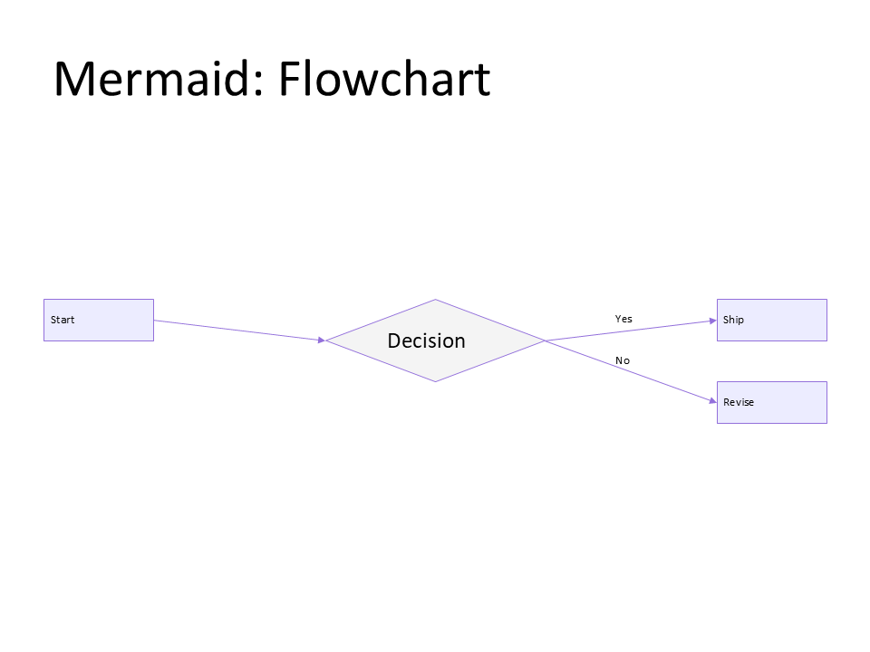

# C01 - Markdown + Mermaid Deck

**Focus:** Generate decks from markdown text specs with Mermaid diagrams.

**Go code**

```go
package main

import (
	"os"
	"path/filepath"

	"github.com/djinn-soul/gopptx/pkg/pptx"
)

func main() {
	markdownPath := filepath.Join("examples", "assets", "03", "markdown_mermaid_complex.md")
	slides, err := pptx.SlidesFromMarkdownFile(markdownPath)
	if err != nil {
		panic(err)
	}

	deck, err := pptx.CreateWithSlides("C01 Markdown + Mermaid Deck", slides)
	if err != nil {
		panic(err)
	}

	_ = os.WriteFile("c01-go.pptx", deck, 0o600)
}
```

**Python code**

```python
from pathlib import Path

from gopptx import Presentation

with Presentation.new("C01 Markdown + Mermaid Deck") as p:
    markdown_path = Path("examples/assets/03/markdown_mermaid_complex.md")
    p.add_slide_from_markdown(markdown_path.read_text(encoding="utf-8"))
    p.save("docs/assets/pptx/usage/c01-python.pptx")
```

**Download PPTX:** [c01-python.pptx](../../../assets/pptx/usage/c01-python.pptx)

Screenshot generated from the Python code above using `export_pptx_png.ps1`.


