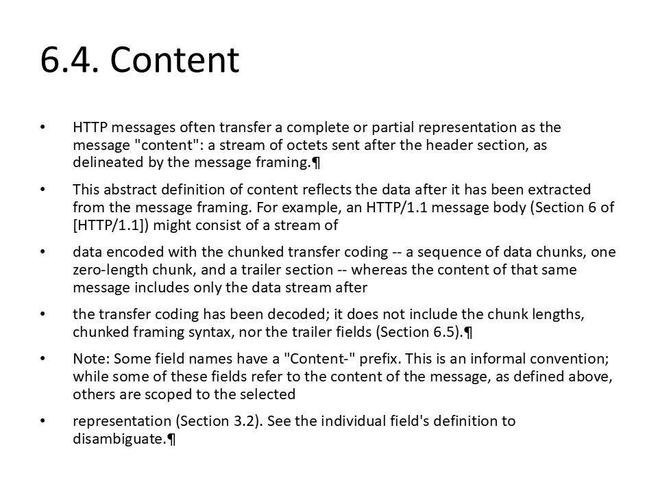

# C02 - URL Fetch to Slides

**Focus:** Convert web content into presentation slides automatically.

**Go code**

```go
package main

import (
	"github.com/djinn-soul/gopptx/pkg/pptx"
)

func main() {
	slides, err := pptx.SlidesFromURL("https://raw.githubusercontent.com/djinn-soul/gopptx/main/README.md")
	if err != nil {
		panic(err)
	}

	_, err = pptx.CreateWithSlides("C02 URL Fetch to Slides", slides)
	if err != nil {
		panic(err)
	}
}
```

**Python code**

```python
from gopptx import Presentation

with Presentation.new("C02 URL Fetch to Slides") as p:
    p.add_slide_from_url("https://raw.githubusercontent.com/djinn-soul/gopptx/main/README.md")
    p.save("docs/assets/pptx/usage/c02-python.pptx")
```

**Download PPTX:** [c02-python.pptx](../../../assets/pptx/usage/c02-python.pptx)

Screenshot generated from the Python code above using `export_pptx_png.ps1`.


