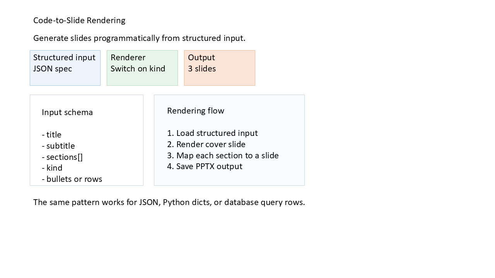

# C03 - Code-to-Slide Rendering

**Focus:** Generate slides programmatically from structured input.

**Go code**

```go
package main

import (
	"github.com/djinn-soul/gopptx/pkg/pptx"
	"github.com/djinn-soul/gopptx/pkg/pptx/styling"
	"github.com/djinn-soul/gopptx/pkg/pptx/tables"
)

type SectionSpec struct {
	Kind    string
	Title   string
	Bullets []string
	Rows    [][]string
}

type DeckSpec struct {
	Title    string
	Subtitle string
	Sections []SectionSpec
}

func addCard(slide pptx.SlideContent, x, y, w, h float64, label, value, fill, line string) pptx.SlideContent {
	return slide.AddShape(
		pptx.NewRoundedRectangle(x, y, w, h).
			WithFill(pptx.NewShapeFill(fill)).
			WithLine(pptx.NewShapeLine(line, pptx.Points(1.0))).
			WithText(label + "\n" + value).
			WithAutoFit(pptx.TextAutoFitNormal),
	)
}

func buildCover(spec DeckSpec) pptx.SlideContent {
	slide := pptx.NewSlide("").WithBlankLayout().
		AddShape(pptx.NewTextBox(spec.Title, 0.8, 0.35, 6.8, 0.5).WithAutoFit(pptx.TextAutoFitNormal)).
		AddShape(pptx.NewTextBox(spec.Subtitle, 0.8, 0.82, 6.8, 0.32).WithAutoFit(pptx.TextAutoFitNormal))
	slide = addCard(slide, 0.8, 1.35, 1.9, 0.95, "Structured input", "JSON spec", "EEF4FB", "A9C4E2")
	slide = addCard(slide, 2.88, 1.35, 1.9, 0.95, "Renderer", "Switch on kind", "E8F5E9", "B8D5B8")
	slide = addCard(slide, 4.96, 1.35, 1.9, 0.95, "Output", "3 slides", "FCE4D6", "E8B89C")
	slide = slide.
		AddShape(
			pptx.NewRoundedRectangle(0.8, 2.55, 3.05, 2.45).
				WithFill(pptx.NewShapeFill("FFFFFF")).
				WithLine(pptx.NewShapeLine("C9D3E0", pptx.Points(1.0))),
		).
		AddShape(
			pptx.NewTextBox("Input schema\n\n- title\n- subtitle\n- sections[]\n- kind\n- bullets or rows", 1.02, 2.82, 2.6, 1.7).
				WithAutoFit(pptx.TextAutoFitNormal),
		).
		AddShape(
			pptx.NewRoundedRectangle(4.15, 2.55, 4.05, 2.45).
				WithFill(pptx.NewShapeFill("F8FBFF")).
				WithLine(pptx.NewShapeLine("C9D3E0", pptx.Points(1.0))),
		).
		AddShape(
			pptx.NewTextBox("Rendering flow\n\n1. Load structured input\n2. Render cover slide\n3. Map each section to a slide\n4. Save PPTX output", 4.4, 2.78, 3.5, 1.8).
				WithAutoFit(pptx.TextAutoFitNormal),
		).
		AddShape(
			pptx.NewTextBox("The same pattern works for JSON, Python dicts, or database query rows.", 0.8, 5.25, 8.0, 0.3).
				WithAutoFit(pptx.TextAutoFitNormal),
		)
	return slide
}

func main() {
	spec := DeckSpec{
		Title:    "Code-to-Slide Rendering",
		Subtitle: "Generate slides programmatically from structured input.",
		Sections: []SectionSpec{
			{
				Kind:  "bullets",
				Title: "Renderer Rules",
				Bullets: []string{
					"Read a JSON or dict payload",
					"Switch on section kind",
					"Emit slides in the declared order",
				},
			},
			{
				Kind:  "table",
				Title: "Metrics Snapshot",
				Rows: [][]string{
					{"Region", "Revenue", "Orders"},
					{"North", "460000", "128"},
					{"West", "370000", "102"},
					{"South", "290000", "96"},
				},
			},
		},
	}

	pres := pptx.NewPresentationBuilder(spec.Title).
		WithSlideSize(pptx.SlideSize16x9()).
		WithTheme(pptx.ThemeTech)
	pres.AddSlide(buildCover(spec))
	pres.AddBulletSlide(spec.Sections[0].Title, spec.Sections[0].Bullets)

	table := tables.NewTable([]styling.Length{
		styling.Inches(1.6), styling.Inches(1.6), styling.Inches(1.6),
	}).
		WithStyledData([][]tables.TableCell{
			{
				pptx.NewTableCell("Region").WithBold(true).WithBackgroundColor("2F6DE1").WithBorder(1, "FFFFFF"),
				pptx.NewTableCell("Revenue").WithBold(true).WithBackgroundColor("2F6DE1").WithBorder(1, "FFFFFF"),
				pptx.NewTableCell("Orders").WithBold(true).WithBackgroundColor("2F6DE1").WithBorder(1, "FFFFFF"),
			},
			{
				pptx.NewTableCell("North"),
				pptx.NewTableCell("460000"),
				pptx.NewTableCell("128"),
			},
			{
				pptx.NewTableCell("West"),
				pptx.NewTableCell("370000"),
				pptx.NewTableCell("102"),
			},
			{
				pptx.NewTableCell("South"),
				pptx.NewTableCell("290000"),
				pptx.NewTableCell("96"),
			},
		}).
		Position(styling.Inches(0.8), styling.Inches(1.35)).
		Size(styling.Inches(6.6), styling.Inches(2.7))

	tableSlide := pptx.NewSlide(spec.Sections[1].Title).WithBlankLayout().
		AddShape(pptx.NewTextBox(spec.Sections[1].Title, 0.8, 0.35, 6.4, 0.45).WithAutoFit(pptx.TextAutoFitNormal)).
		AddShape(pptx.NewTextBox("Table rows can be sourced from CSV files or SQL query results.", 0.8, 4.35, 6.8, 0.3).WithAutoFit(pptx.TextAutoFitNormal)).
		WithTable(table)
	pres.AddSlide(tableSlide)
	_ = pres.WriteToFile("c03-go.pptx")
}
```

**Python code**

```python
from __future__ import annotations

import json

from gopptx import Presentation, ShapeType
from gopptx.constants import SIZE_16X9_HEIGHT, SIZE_16X9_WIDTH
from gopptx.presentation.theme import get_theme
from gopptx.schemas import Inches

DECK_JSON = """
{
  "title": "Code-to-Slide Rendering",
  "subtitle": "Generate slides programmatically from structured input.",
  "sections": [
    {
      "kind": "bullets",
      "title": "Renderer Rules",
      "bullets": [
        "Read a JSON or dict payload",
        "Switch on section kind",
        "Emit slides in the declared order"
      ]
    },
    {
      "kind": "table",
      "title": "Metrics Snapshot",
      "rows": [
        ["Region", "Revenue", "Orders"],
        ["North", "460000", "128"],
        ["West", "370000", "102"],
        ["South", "290000", "96"]
      ]
    }
  ]
}
"""


def load_spec() -> dict[str, object]:
    return json.loads(DECK_JSON)


def add_card(slide, x: float, y: float, w: float, h: float, label: str, value: str, fill: str, line: str) -> None:
    slide.add_shape(
        ShapeType.ROUNDED_RECTANGLE,
        (Inches(x), Inches(y), Inches(w), Inches(h)),
        text=f"{label}\n{value}",
        properties={
            "fill": {"solid": fill},
            "line": {"color": line, "width_emu": 12700},
        },
    )


def render_cover(slide, spec: dict[str, object], section_count: int) -> None:
    slide.add_textbox(Inches(0.8), Inches(0.35), Inches(6.8), Inches(0.5), text=str(spec["title"]))
    slide.add_textbox(Inches(0.8), Inches(0.82), Inches(6.8), Inches(0.32), text=str(spec["subtitle"]))
    add_card(slide, 0.8, 1.35, 1.9, 0.95, "Structured input", "JSON spec", "EEF4FB", "A9C4E2")
    add_card(slide, 2.88, 1.35, 1.9, 0.95, "Renderer", "Switch on kind", "E8F5E9", "B8D5B8")
    add_card(slide, 4.96, 1.35, 1.9, 0.95, "Output", f"{section_count + 1} slides", "FCE4D6", "E8B89C")

    slide.add_shape(
        ShapeType.ROUNDED_RECTANGLE,
        (Inches(0.8), Inches(2.55), Inches(3.05), Inches(2.45)),
        properties={
            "fill": {"solid": "FFFFFF"},
            "line": {"color": "C9D3E0", "width_emu": 12700},
        },
    )
    slide.add_textbox(
        Inches(1.02),
        Inches(2.82),
        Inches(2.6),
        Inches(1.7),
        text="Input schema\n\n- title\n- subtitle\n- sections[]\n- kind\n- bullets or rows",
    )

    slide.add_shape(
        ShapeType.ROUNDED_RECTANGLE,
        (Inches(4.15), Inches(2.55), Inches(4.05), Inches(2.45)),
        properties={
            "fill": {"solid": "F8FBFF"},
            "line": {"color": "C9D3E0", "width_emu": 12700},
        },
    )
    slide.add_textbox(
        Inches(4.4),
        Inches(2.78),
        Inches(3.5),
        Inches(1.8),
        text=(
            "Rendering flow\n\n"
            "1. Load structured input\n"
            "2. Render cover slide\n"
            "3. Map each section to a slide\n"
            "4. Save PPTX output"
        ),
    )
    slide.add_textbox(
        Inches(0.8),
        Inches(5.25),
        Inches(8.0),
        Inches(0.3),
        text="The same pattern works for JSON, Python dicts, or database query rows.",
    )


spec = load_spec()
sections = list(spec["sections"])

with Presentation.new(str(spec["title"])) as p:
    p.set_slide_size(SIZE_16X9_WIDTH, SIZE_16X9_HEIGHT)
    p.apply_theme(get_theme("ocean"))
    p.update_slide(0, layout="blank")
    render_cover(p.slides[0], spec, len(sections))

    p.add_bullet_slide(str(sections[0]["title"]), [str(item) for item in sections[0]["bullets"]])

    p.add_slide(str(sections[1]["title"]), layout="blank")
    p.update_slide(2, layout="blank")
    table_slide = p.slides[2]
    table_slide.add_textbox(
        Inches(0.8),
        Inches(0.35),
        Inches(6.4),
        Inches(0.45),
        text=str(sections[1]["title"]),
    )
    p.add_table(
        slide=2,
        rows=4,
        cols=3,
        bounds=(Inches(0.8), Inches(1.35), Inches(6.6), Inches(2.7)),
        data=[[str(cell) for cell in row] for row in sections[1]["rows"]],
        first_row=True,
        band_row=True,
    )
    table_slide.add_textbox(
        Inches(0.8),
        Inches(4.35),
        Inches(6.8),
        Inches(0.3),
        text="Table rows can be sourced from CSV files or SQL query results.",
    )
    p.save("docs/assets/pptx/usage/c03-python.pptx")
```

**Download PPTX:** [c03-python.pptx](../../../assets/pptx/usage/c03-python.pptx)

Screenshot generated from the code above using `export_pptx_png.ps1`.


