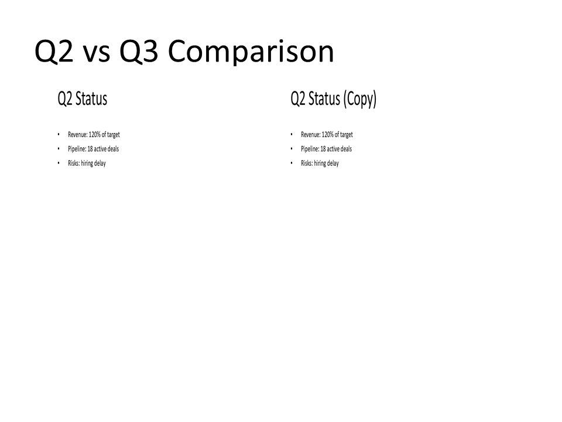

# C04 - Clone / Duplicate Slide Content

**Focus:** Reuse slide structure with changed data.

**Go code**

```go
package main

import "github.com/djinn-soul/gopptx/pkg/pptx"

func main() {
	pres := pptx.NewPresentationBuilder("C04 Clone Duplicate Slide")

	original := pptx.NewSlide("Original").AddBullet("Original content")
	pres.AddSlide(original)

	// Reconstruct with the same content under a new title
	duplicate := pptx.NewSlide("Cloned Copy").AddBullet("Original content")
	pres.AddSlide(duplicate)

	_ = pres.WriteToFile("c04-go.pptx")
}
```

**Python code**

```python
from gopptx import Inches, Presentation

with Presentation.new("C04 Clone Duplicate Slide") as p:
    p.add_slide("Original")
    p.slides[0].add_textbox(Inches(0.8), Inches(2.0), Inches(8.0), Inches(1.5), text="Original content")

    # duplicate() inserts the copy into the deck and returns it — do not
    # pass the result back to add_slide().
    cloned = p.slides[0].duplicate()
    cloned.title = "Cloned Copy"

    p.save("docs/assets/pptx/usage/c04-python.pptx")
```

**Download PPTX:** [c04-python.pptx](../../../assets/pptx/usage/c04-python.pptx)

Screenshot generated from the Python code above using `export_pptx_png.ps1`.


