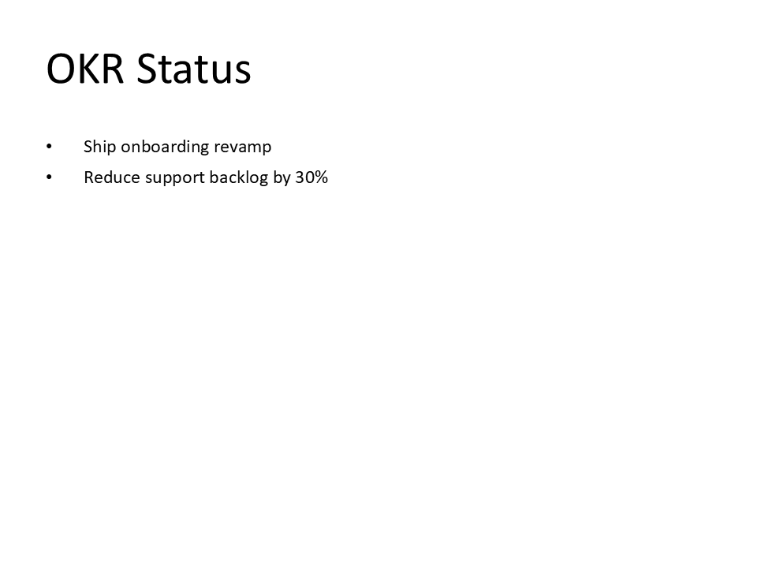

# C05 - Template + Data Injection System

**Focus:** Use templates with dynamic data injection.

**Go code**

A template is a typed struct that knows how to build its own slides. Fill in the data, call
`Build()`, and hand the slides to the builder.

```go
package main

import (
	"github.com/djinn-soul/gopptx/pkg/pptx"
	"github.com/djinn-soul/gopptx/pkg/pptx/templates"
)

func main() {
	template := templates.StatusTemplate{
		Project: "Q4 Financial Report",
		OKRs: []string{
			"Revenue: 1,250,000",
			"Expenses: 890,000",
			"Profit: 360,000",
		},
		Risks:     []string{"FX exposure in EMEA"},
		NextSteps: []string{"Lock the Q1 plan", "Brief the board"},
		Branding:  templates.BrandingSpec{Preset: templates.PresetCorporate},
	}

	slides, err := template.Build()
	if err != nil {
		panic(err)
	}

	builder := pptx.NewPresentationBuilder("C05 Template")
	for _, slide := range slides {
		builder.AddSlide(slide)
	}

	if err := builder.WriteToFile("c05-go.pptx"); err != nil {
		panic(err)
	}
}
```

`SimpleTemplate`, `ProposalTemplate`, `TrainingTemplate` and `TechnicalTemplate` follow the same
shape — all satisfy the one-method `templates.Template` interface.

**Python code**

Python injects data a different way: open an existing deck as a Jinja2 template and render its
tags against a context.

```python
from gopptx import Presentation

data = {
    "title": "Q4 Financial Report",
    "period": "Q4 2023",
    "revenue": "1,250,000",
    "expenses": "890,000",
    "profit": "360,000",
}

# financial_template.pptx contains tags such as {{ title }} and {{ revenue }}
with Presentation.from_template("financial_template.pptx", data) as p:
    p.save("docs/assets/pptx/usage/c05-python.pptx")
```

`Presentation.render_template(context)` does the same thing on a deck that is already open, and
returns how many expressions it replaced.

**Download PPTX:** [c05-python.pptx](../../../assets/pptx/usage/c05-python.pptx)

Screenshot generated from the Python code above using `export_pptx_png.ps1`.


