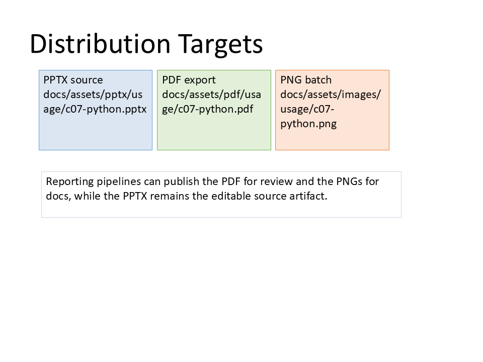

# C07 - Export & Distribution Pipeline

**Focus:** Automate export and distribution workflows.

**Go code**

```go
package main

import (
	"os"
	"github.com/djinn-soul/gopptx/pkg/pptx"
	"github.com/djinn-soul/gopptx/pkg/pptx/export"
)

func main() {
	pres := pptx.NewPresentationBuilder("C07 Export Pipeline")
	pres.AddSlide(pptx.NewSlide("Export Demo").AddBullet("PDF export").AddBullet("HTML export"))

	pptxBytes, _ := pres.Build()

	os.WriteFile("c07.pptx", pptxBytes, 0644)

	_ = export.PDFFromFile("c07.pptx", "c07.pdf")
}
```

**Python code**

```python
from gopptx import HTMLOptions, Inches, PDFOptions, Presentation

with Presentation.new("C07 Export Pipeline") as p:
    p.add_slide("Export Demo")
    p.slides[0].add_textbox(
        Inches(0.8), Inches(2.0), Inches(8.0), Inches(2.0),
        text="PDF export\nHTML export",
    )

    p.save("docs/assets/pptx/usage/c07-python.pptx")
    p.export_pdf("c07.pdf", PDFOptions(driver="auto"))
    p.export_html("c07.html", HTMLOptions(embed_images=True))
```

**Download PPTX:** [c07-python.pptx](../../../assets/pptx/usage/c07-python.pptx)

Screenshot generated from the Python code above using `export_pptx_png.ps1`.


