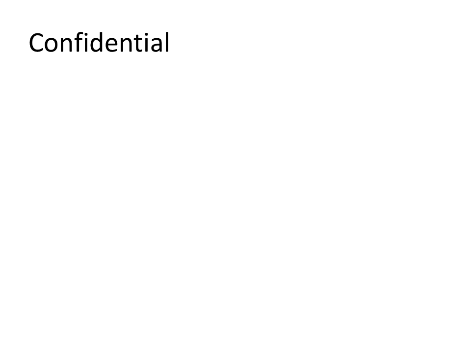

# C10 - Presentation Protection

**Focus:** Protect presentations with passwords and permissions.

**Go code**

```go
package main

import "github.com/djinn-soul/gopptx/pkg/pptx"

func main() {
	pres := pptx.NewPresentationBuilder("C10 Protection")

	pres.AddSlide(pptx.NewSlide("Protected Content").
		AddBullet("Sensitive information"))

	pres.WithModifyPassword("secret123")
	pres.WithMarkAsFinal(false)

	_ = pres.WriteToFile("c10-go.pptx")
}
```

**Python code**

```python
from gopptx import Inches, Presentation

with Presentation.new("C10 Protection") as p:
    p.add_slide("Protected Content")
    p.slides[0].add_textbox(Inches(0.8), Inches(2.0), Inches(8.0), Inches(1.5), text="Sensitive information")

    p.set_modify_password("secret123")
    p.set_mark_as_final(final=True)   # `final` is keyword-only
    p.save("docs/assets/pptx/usage/c10-python.pptx")
```

**Download PPTX:** [c10-python.pptx](../../../assets/pptx/usage/c10-python.pptx)

Screenshot generated from the Python code above using `export_pptx_png.ps1`.


