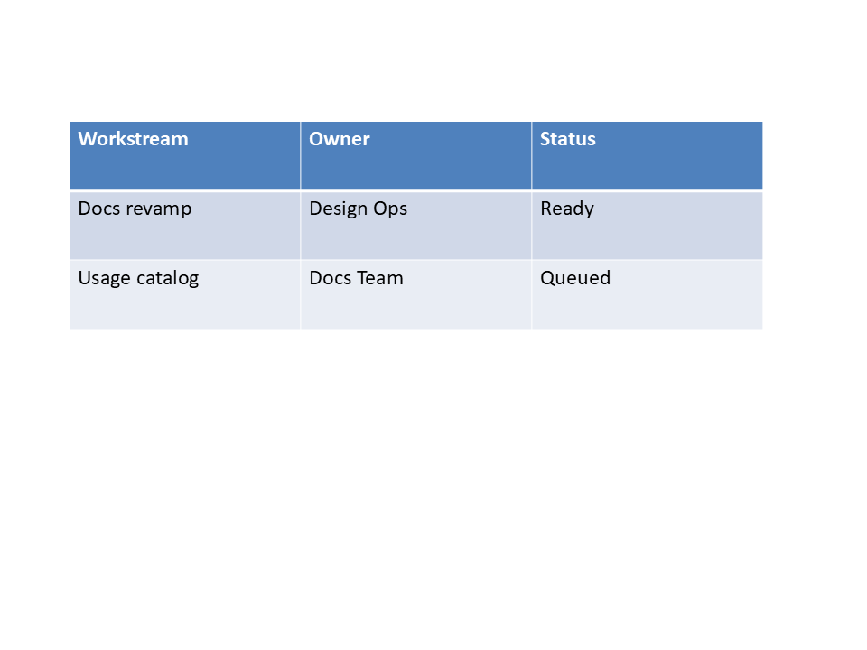
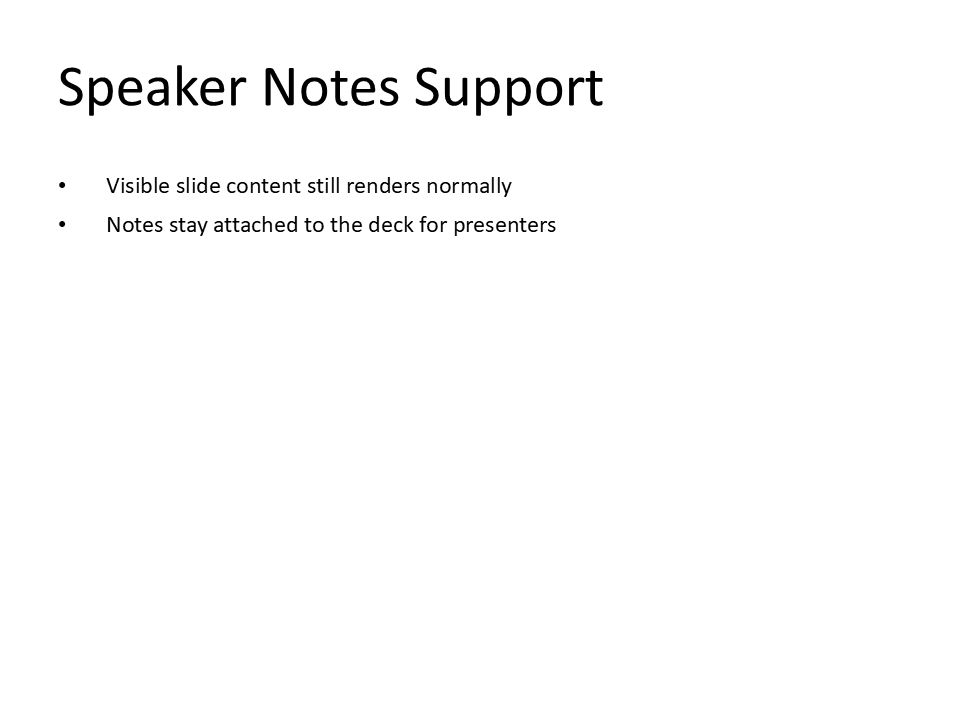
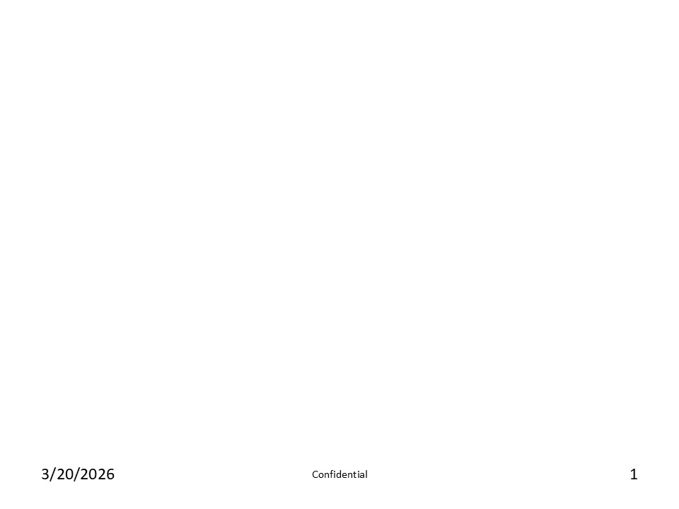
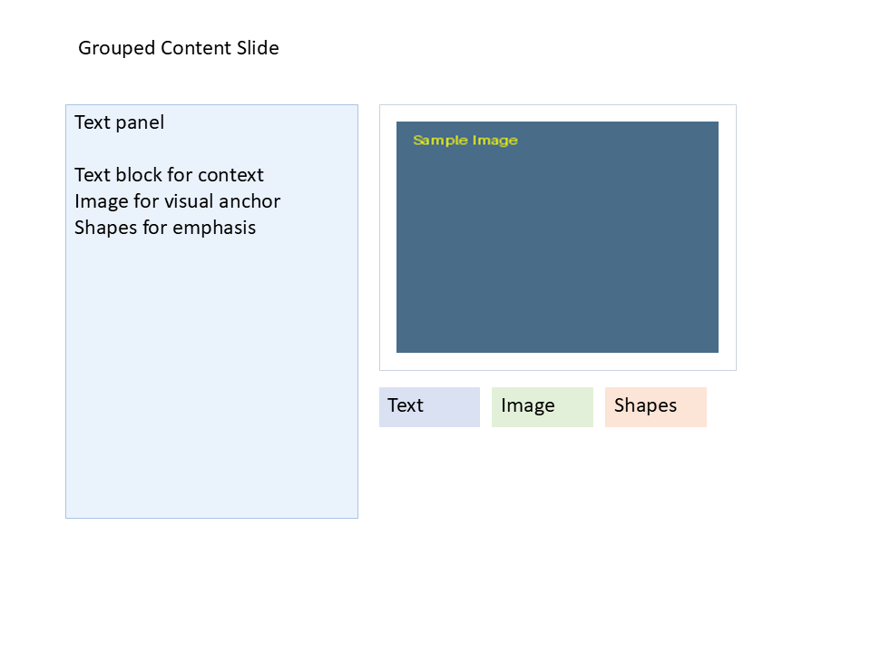
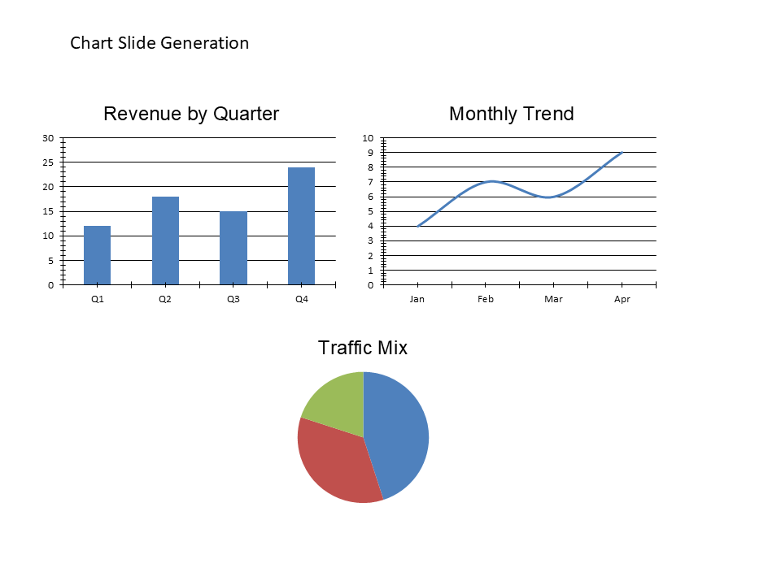
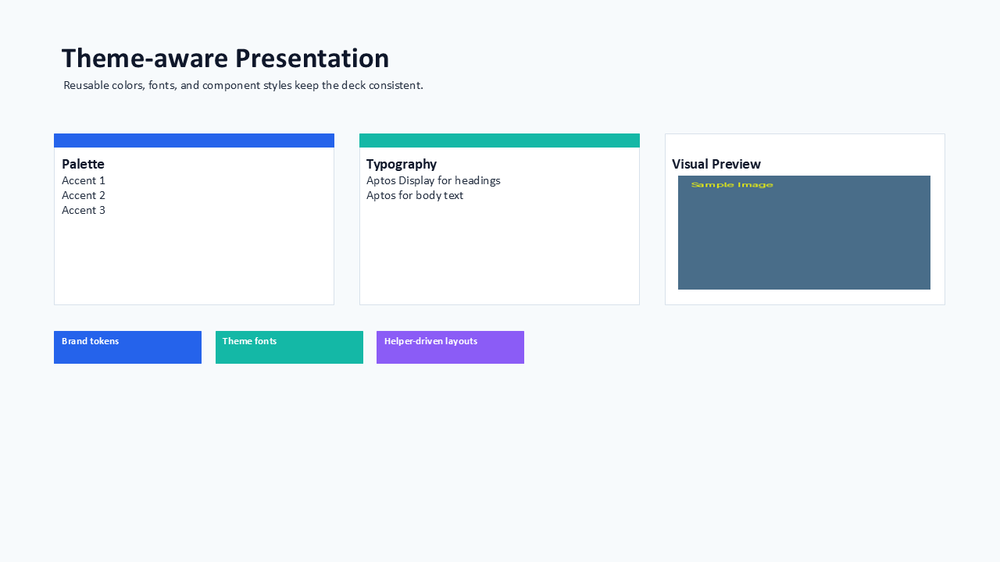
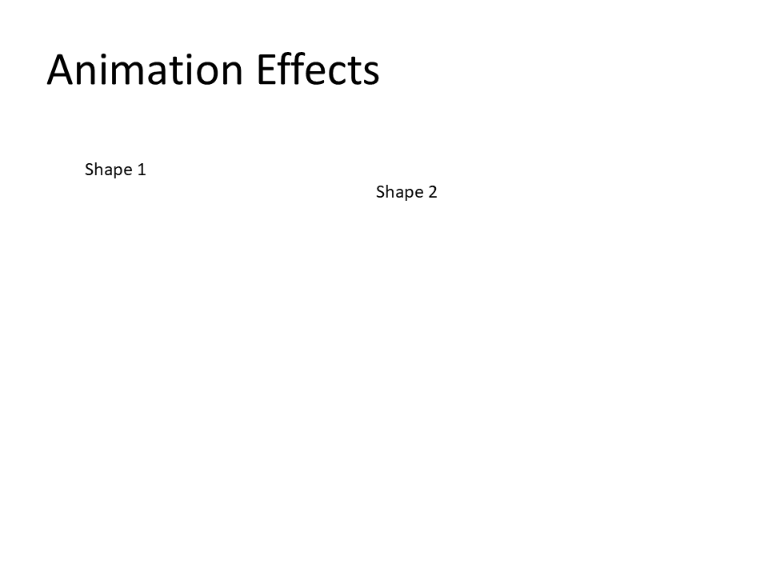

# Intermediate Usages (10)

Use these when you need richer visuals and editing workflows.

Each usage is code-first and screenshot is generated from that Python code.

## I01 - Project Status Table

**Focus:** Present workstreams, owners, and status in a simple table.

**Go code**

```go
package main

import "github.com/djinn-soul/gopptx/pkg/pptx"

func main() {
	pres := pptx.NewPresentationBuilder("I01 Project Status Table")
	pres.AddSlide(
		pptx.NewSlide("Project Status Table").WithTable(
			pptx.NewTable([]pptx.Length{pptx.Inches(2.6), pptx.Inches(2.6), pptx.Inches(2.6)}).
				WithStyledData([][]pptx.TableCell{
					{
						pptx.NewTableCell("Workstream").WithBold(true).WithBackgroundColor("DCE6F2"),
						pptx.NewTableCell("Owner").WithBold(true).WithBackgroundColor("DCE6F2"),
						pptx.NewTableCell("Status").WithBold(true).WithBackgroundColor("DCE6F2"),
					},
					{
						pptx.NewTableCell("Docs revamp"),
						pptx.NewTableCell("Design Ops"),
						pptx.NewTableCell("Ready"),
					},
					{
						pptx.NewTableCell("Usage catalog"),
						pptx.NewTableCell("Docs Team"),
						pptx.NewTableCell("Queued"),
					},
				}),
		),
	)
	_ = pres.WriteToFile("i01-go.pptx")
}
```

**Python code**

```python
from gopptx import Presentation
from gopptx.schemas import Inches

with Presentation.new("I01 Project Status Table") as p:
    p.update_slide(0, layout="blank")
    p.add_table(
        0,
        3,
        3,
        (Inches(0.8), Inches(1.4), Inches(8.0), Inches(2.4)),
        data=[
            ["Workstream", "Owner", "Status"],
            ["Docs revamp", "Design Ops", "Ready"],
            ["Usage catalog", "Docs Team", "Queued"],
        ],
        first_row=True,
        band_row=True,
    )
    p.save("docs/assets/pptx/usage/i01-python.pptx")
```

**Download PPTX:** [i01-python.pptx](../../assets/pptx/usage/i01-python.pptx)

Screenshot generated from the Python code above using `export_pptx_png.ps1`.



## I02 - Speaker Notes Support

**Focus:** Attach notes to slides.

**Go code**

```go
package main

import "github.com/djinn-soul/gopptx/pkg/pptx"

func main() {
	pres := pptx.NewPresentationBuilder("I02 Speaker Notes Support")
	pres.AddSlide(
		pptx.NewSlide("").WithBlankLayout().
			WithNotes("Presenter notes:\n- Introduce the agenda\n- Call out the demo flow\n- Remind the audience about next steps"),
	)
	_ = pres.WriteToFile("i02-go.pptx")
}
```

**Python code**

```python
from gopptx import Presentation

with Presentation.new("I02 Speaker Notes Support") as p:
    p.update_slide(0, layout="blank")
    p.slides[0].notes = (
        "Presenter notes:\n"
        "- Introduce the agenda\n"
        "- Call out the demo flow\n"
        "- Remind the audience about next steps"
    )
    p.save("docs/assets/pptx/usage/i02-python.pptx")
```

**Download PPTX:** [i02-python.pptx](../../assets/pptx/usage/i02-python.pptx)

Screenshot generated from the Python code above using `export_pptx_png.ps1`.



## I03 - Headers and Footers

**Focus:** Add page numbers, date, or custom footer text.

**Go code**

```go
package main

import "github.com/djinn-soul/gopptx/pkg/pptx"

func main() {
	pres := pptx.NewPresentationBuilder("I03 Headers and Footers").
		WithFooter("Confidential").
		WithDateTime(true).
		WithSlideNumbers(true)
	pres.AddSlide(
		pptx.NewSlide("").WithBlankLayout(),
	)
	_ = pres.WriteToFile("i03-go.pptx")
}
```

**Python code**

```python
from gopptx import Presentation

with Presentation.new("I03 Headers and Footers") as p:
    p.update_slide(0, layout="blank")
    p.slides[0].set_header_footer(
        footer="Confidential",
        show_footer=True,
        show_slide_num=True,
        show_date_time=True,
        date_time_text="2026-03-20",
    )
    p.save("docs/assets/pptx/usage/i03-python.pptx")
```

**Download PPTX:** [i03-python.pptx](../../assets/pptx/usage/i03-python.pptx)

Screenshot generated from the Python code above using `export_pptx_png.ps1`.



## I04 - Grouped Content Slide

**Focus:** Combine text, image, and shapes in one slide.

**Go code**

```go
package main

import "github.com/djinn-soul/gopptx/pkg/pptx"

func main() {
	slide := pptx.NewSlide("").WithBlankLayout().
		AddShape(pptx.NewTextBox("Grouped Content Slide", 0.8, 0.35, 5.8, 0.45)).
		AddShape(
			pptx.NewRoundedRectangle(0.75, 1.2, 3.35, 4.75).
				WithFill(pptx.NewShapeFill("EAF2FC")).
				WithLine(pptx.NewShapeLine("A9C4E2", pptx.Points(1.2))).
				WithText("Text panel\n\nText block for context\nImage for visual anchor\nShapes for emphasis").
				WithAutoFit(pptx.TextAutoFitNormal),
		).
		AddShape(
			pptx.NewRoundedRectangle(4.35, 1.2, 4.1, 3.05).
				WithFill(pptx.NewShapeFill("FFFFFF")).
				WithLine(pptx.NewShapeLine("C9D3E0", pptx.Points(1.1))),
		).
		AddImage(
			pptx.NewImage(
				"examples/assets/test_image.png",
				pptx.Inches(4.55),
				pptx.Inches(1.4),
				pptx.Inches(3.7),
				pptx.Inches(2.65),
			),
		).
		AddShape(
			pptx.NewRoundedRectangle(4.35, 4.45, 1.15, 0.45).
				WithText("Text").
				WithFill(pptx.NewShapeFill("D9E1F2")).
				WithLine(pptx.NewShapeLine("D9E1F2", pptx.Points(1.0))).
				WithAutoFit(pptx.TextAutoFitNormal),
		).
		AddShape(
			pptx.NewRoundedRectangle(5.65, 4.45, 1.15, 0.45).
				WithText("Image").
				WithFill(pptx.NewShapeFill("E2F0D9")).
				WithLine(pptx.NewShapeLine("E2F0D9", pptx.Points(1.0))).
				WithAutoFit(pptx.TextAutoFitNormal),
		).
		AddShape(
			pptx.NewRoundedRectangle(6.95, 4.45, 1.15, 0.45).
				WithText("Shapes").
				WithFill(pptx.NewShapeFill("FCE4D6")).
				WithLine(pptx.NewShapeLine("FCE4D6", pptx.Points(1.0))).
				WithAutoFit(pptx.TextAutoFitNormal),
		)
	pres := pptx.NewPresentationBuilder("I04 Grouped Content Slide")
	pres.AddSlide(slide)
	_ = pres.WriteToFile("i04-go.pptx")
}
```

**Python code**

```python
from gopptx import Presentation, ShapeType
from gopptx.schemas import Inches

with Presentation.new("I04 Grouped Content Slide") as p:
    p.update_slide(0, layout="blank")
    p.add_textbox(
        0,
        Inches(0.8),
        Inches(0.35),
        Inches(5.8),
        Inches(0.45),
        text="Grouped Content Slide",
    )
    p.add_shape(
        0,
        ShapeType.ROUNDED_RECTANGLE,
        (Inches(0.75), Inches(1.2), Inches(3.35), Inches(4.75)),
        text="Text panel\n\nText block for context\nImage for visual anchor\nShapes for emphasis",
        properties={
            "fill": {"solid": "EAF2FC"},
            "line": {"color": "A9C4E2", "width_emu": 12700},
        },
    )
    p.add_shape(
        0,
        ShapeType.ROUNDED_RECTANGLE,
        (Inches(4.35), Inches(1.2), Inches(4.1), Inches(3.05)),
        properties={
            "fill": {"solid": "FFFFFF"},
            "line": {"color": "C9D3E0", "width_emu": 12700},
        },
    )
    p.add_image(
        0,
        "examples/assets/test_image.png",
        (Inches(4.55), Inches(1.4), Inches(3.7), Inches(2.65)),
    )
    p.add_shape(
        0,
        ShapeType.ROUNDED_RECTANGLE,
        (Inches(4.35), Inches(4.45), Inches(1.15), Inches(0.45)),
        text="Text",
        properties={
            "fill": {"solid": "D9E1F2"},
            "line": {"color": "D9E1F2", "width_emu": 12700},
        },
    )
    p.add_shape(
        0,
        ShapeType.ROUNDED_RECTANGLE,
        (Inches(5.65), Inches(4.45), Inches(1.15), Inches(0.45)),
        text="Image",
        properties={
            "fill": {"solid": "E2F0D9"},
            "line": {"color": "E2F0D9", "width_emu": 12700},
        },
    )
    p.add_shape(
        0,
        ShapeType.ROUNDED_RECTANGLE,
        (Inches(6.95), Inches(4.45), Inches(1.15), Inches(0.45)),
        text="Shapes",
        properties={
            "fill": {"solid": "FCE4D6"},
            "line": {"color": "FCE4D6", "width_emu": 12700},
        },
    )
    p.save("docs/assets/pptx/usage/i04-python.pptx")
```

**Download PPTX:** [i04-python.pptx](../../assets/pptx/usage/i04-python.pptx)

Screenshot generated from the Python code above using `export_pptx_png.ps1`.



## I05 - Chart Slide Generation

**Focus:** Create bar, line, or pie charts from data.

**Go code**

```go
package main

import "github.com/djinn-soul/gopptx/pkg/pptx"

func main() {
	slide := pptx.NewSlide("").WithBlankLayout().
		AddShape(pptx.NewTextBox("Chart Slide Generation", 0.8, 0.35, 6.0, 0.45)).
		WithBarChart(
			pptx.NewBarChart(
				[]string{"Q1", "Q2", "Q3", "Q4"},
				[]float64{12, 18, 15, 24},
			).
				WithTitle("Revenue by Quarter").
				Position(pptx.Inches(0.45), pptx.Inches(1.2)).
				Size(pptx.Inches(4.0), pptx.Inches(2.8)),
		).
		WithLineChart(
			pptx.NewLineChart(
				[]string{"Jan", "Feb", "Mar", "Apr"},
				[]float64{4, 7, 6, 9},
			).
				WithTitle("Monthly Trend").
				Position(pptx.Inches(4.55), pptx.Inches(1.2)).
				Size(pptx.Inches(4.0), pptx.Inches(2.8)),
		).
		WithPieChart(
			pptx.NewPieChart(
				[]string{"Direct", "Search", "Referral"},
				[]float64{45, 35, 20},
			).
				WithTitle("Traffic Mix").
				WithLegend(true).
				WithLegendPosition("b").
				Position(pptx.Inches(2.55), pptx.Inches(4.2)).
				Size(pptx.Inches(4.2), pptx.Inches(2.4)),
		)

	pres := pptx.NewPresentationBuilder("I05 Chart Slide Generation")
	pres.AddSlide(slide)
	_ = pres.WriteToFile("i05-go.pptx")
}
```

**Python code**

```python
from gopptx import Presentation
from gopptx.schemas import Inches

with Presentation.new("I05 Chart Slide Generation") as p:
    p.update_slide(0, layout="blank")
    slide = p.slides[0]
    slide.add_textbox(
        Inches(0.8),
        Inches(0.35),
        Inches(6.0),
        Inches(0.45),
        text="Chart Slide Generation",
    )
    slide.add_chart(
        "bar",
        ["Q1", "Q2", "Q3", "Q4"],
        [12.0, 18.0, 15.0, 24.0],
        title="Revenue by Quarter",
        bounds=(Inches(0.45), Inches(1.2), Inches(4.0), Inches(2.8)),
    )
    slide.add_chart(
        "line",
        ["Jan", "Feb", "Mar", "Apr"],
        [4.0, 7.0, 6.0, 9.0],
        title="Monthly Trend",
        bounds=(Inches(4.55), Inches(1.2), Inches(4.0), Inches(2.8)),
    )
    slide.add_chart(
        "pie",
        ["Direct", "Search", "Referral"],
        [45.0, 35.0, 20.0],
        title="Traffic Mix",
        bounds=(Inches(2.55), Inches(4.2), Inches(4.2), Inches(2.4)),
    )
    p.save("docs/assets/pptx/usage/i05-python.pptx")
```

**Download PPTX:** [i05-python.pptx](../../assets/pptx/usage/i05-python.pptx)

Screenshot generated from the Python code above using `export_pptx_png.ps1`.



## I06 - Custom Slide Layout Composition

**Focus:** Build reusable structured slide layouts.

**Go code**

```go
package main

import "github.com/djinn-soul/gopptx/pkg/pptx"

func buildStructuredSlide(title, tag string, points []string, imagePath string) pptx.SlideContent {
	body := points[0] + "\n" + points[1] + "\n" + points[2]
	return pptx.NewSlide("").WithBlankLayout().
		AddShape(
			pptx.NewTextBox(title, 0.8, 0.35, 6.4, 0.45).
				WithAutoFit(pptx.TextAutoFitNormal),
		).
		AddShape(
			pptx.NewRoundedRectangle(0.75, 1.15, 3.45, 4.85).
				WithFill(pptx.NewShapeFill("EEF4FB")).
				WithLine(pptx.NewShapeLine("B7CBE3", pptx.Points(1.1))).
				WithText(tag + "\n\n" + body).
				WithAutoFit(pptx.TextAutoFitNormal),
		).
		AddShape(
			pptx.NewRoundedRectangle(4.45, 1.15, 4.0, 3.15).
				WithFill(pptx.NewShapeFill("FFFFFF")).
				WithLine(pptx.NewShapeLine("C8D0DA", pptx.Points(1.0))),
		).
		AddImage(
			pptx.NewImage(imagePath, pptx.Inches(4.63), pptx.Inches(1.32), pptx.Inches(3.84), pptx.Inches(2.78)),
		).
		AddShape(
			pptx.NewRoundedRectangle(4.45, 4.45, 1.2, 0.48).
				WithText("Plan").
				WithFill(pptx.NewShapeFill("DCE6F2")).
				WithLine(pptx.NewShapeLine("DCE6F2", pptx.Points(1.0))).
				WithAutoFit(pptx.TextAutoFitNormal),
		).
		AddShape(
			pptx.NewRoundedRectangle(5.78, 4.45, 1.2, 0.48).
				WithText("Build").
				WithFill(pptx.NewShapeFill("E2F0D9")).
				WithLine(pptx.NewShapeLine("E2F0D9", pptx.Points(1.0))).
				WithAutoFit(pptx.TextAutoFitNormal),
		).
		AddShape(
			pptx.NewRoundedRectangle(7.11, 4.45, 1.2, 0.48).
				WithText("Review").
				WithFill(pptx.NewShapeFill("FCE4D6")).
				WithLine(pptx.NewShapeLine("FCE4D6", pptx.Points(1.0))).
				WithAutoFit(pptx.TextAutoFitNormal),
		)
}

func main() {
	slides := []pptx.SlideContent{
		buildStructuredSlide(
			"Custom Slide Layout Composition",
			"Overview",
			[]string{
				"Reusable title and summary region",
				"Dedicated image card for visuals",
				"Consistent footer chips for structure",
			},
			"examples/assets/test_image.png",
		),
		buildStructuredSlide(
			"Custom Slide Layout Composition",
			"Execution",
			[]string{
				"Same helper builds another slide",
				"Only the content tags change",
				"Layout stays stable across pages",
			},
			"examples/assets/test_image.png",
		),
	}
	data, _ := pptx.CreateWithSlides("I06 Custom Slide Layout Composition", slides)
	_ = data
}
```

**Python code**

```python
from gopptx import Presentation, ShapeType
from gopptx.schemas import Inches


def build_structured_slide(slide, title, tag, points, image_path):
    body = "\n".join(points)
    slide.add_textbox(
        Inches(0.8),
        Inches(0.35),
        Inches(6.4),
        Inches(0.45),
        text=title,
    )
    slide.add_shape(
        ShapeType.ROUNDED_RECTANGLE,
        (Inches(0.75), Inches(1.15), Inches(3.45), Inches(4.85)),
        text=f"{tag}\n\n{body}",
        properties={
            "fill": {"solid": "EEF4FB"},
            "line": {"color": "B7CBE3", "width_emu": 12700},
        },
    )
    slide.add_shape(
        ShapeType.ROUNDED_RECTANGLE,
        (Inches(4.45), Inches(1.15), Inches(4.0), Inches(3.15)),
        properties={
            "fill": {"solid": "FFFFFF"},
            "line": {"color": "C8D0DA", "width_emu": 12700},
        },
    )
    slide.add_image(
        image_path,
        (Inches(4.63), Inches(1.32), Inches(3.84), Inches(2.78)),
    )
    slide.add_shape(
        ShapeType.ROUNDED_RECTANGLE,
        (Inches(4.45), Inches(4.45), Inches(1.2), Inches(0.48)),
        text="Plan",
        properties={
            "fill": {"solid": "DCE6F2"},
            "line": {"color": "DCE6F2", "width_emu": 12700},
        },
    )
    slide.add_shape(
        ShapeType.ROUNDED_RECTANGLE,
        (Inches(5.78), Inches(4.45), Inches(1.2), Inches(0.48)),
        text="Build",
        properties={
            "fill": {"solid": "E2F0D9"},
            "line": {"color": "E2F0D9", "width_emu": 12700},
        },
    )
    slide.add_shape(
        ShapeType.ROUNDED_RECTANGLE,
        (Inches(7.11), Inches(4.45), Inches(1.2), Inches(0.48)),
        text="Review",
        properties={
            "fill": {"solid": "FCE4D6"},
            "line": {"color": "FCE4D6", "width_emu": 12700},
        },
    )
    return slide


with Presentation.new("I06 Custom Slide Layout Composition") as p:
    p.update_slide(0, layout="blank")
    build_structured_slide(
        p.slides[0],
        "Custom Slide Layout Composition",
        "Overview",
        [
            "Reusable title and summary region",
            "Dedicated image card for visuals",
            "Consistent footer chips for structure",
        ],
        "examples/assets/test_image.png",
    )
    build_structured_slide(
        p.add_slide("Custom Slide Layout Composition", layout="blank"),
        "Custom Slide Layout Composition",
        "Execution",
        [
            "Same helper builds another slide",
            "Only the content tags change",
            "Layout stays stable across pages",
        ],
        "examples/assets/test_image.png",
    )
    p.save("docs/assets/pptx/usage/i06-python.pptx")
```

**Download PPTX:** [i06-python.pptx](../../assets/pptx/usage/i06-python.pptx)

Screenshot generated from the Python code above using `export_pptx_png.ps1`.


## I07 - Theme-aware Presentation

**Focus:** Apply reusable colors, fonts, and style settings.

**Go code**

```go
package main

import (
	"os"

	"github.com/djinn-soul/gopptx/pkg/pptx"
	"github.com/djinn-soul/gopptx/pkg/pptx/elements"
	"github.com/djinn-soul/gopptx/pkg/pptx/shapes"
	"github.com/djinn-soul/gopptx/pkg/pptx/styling"
)

const (
	bg     = "F7FAFC"
	ink    = "0F172A"
	muted  = "475569"
	border = "D8E1EB"

	accent1 = "2563EB"
	accent2 = "14B8A6"
	accent3 = "F59E0B"
)

const imagePath = "examples/assets/test_image.png"

func auroraTheme() styling.Theme {
	return styling.Theme{
		Name: "Aurora",
		Colors: styling.ColorScheme{
			Name:    "Aurora",
			Dk1:     ink,
			Lt1:     "FFFFFF",
			Dk2:     "1E293B",
			Lt2:     bg,
			Accent1: accent1,
			Accent2: accent2,
			Accent3: accent3,
			Accent4: "8B5CF6",
			Accent5: "EC4899",
			Accent6: "0EA5E9",
			Hlink:   accent1,
		},
		Fonts: styling.FontScheme{
			Name:      "Aurora",
			MajorFont: "Aptos Display",
			MinorFont: "Aptos",
		},
	}
}

func auroraMaster() *elements.SlideMaster {
	return elements.NewMaster().
		WithBackground(elements.NewSolidBackground(bg)).
		WithColorMapping("lt1", "dk1").
		WithTitleStyle([]elements.TextLevelStyle{{Level: 0, Font: "Aptos Display", SizePt: 28, Bold: true, Color: ink}}).
		WithBodyStyle([]elements.TextLevelStyle{{Level: 0, Font: "Aptos", SizePt: 12, Color: muted}})
}

func addCard(s elements.SlideContent, x float64, accent, title, body string) elements.SlideContent {
	card := shapes.NewRoundedRectangle(x, 1.78, 3.73, 2.28).
		WithFill(pptx.NewShapeFill("FFFFFF")).
		WithLine(pptx.NewShapeLine(border, styling.Points(1))).
		WithText("\n" + title + "\n" + body).
		WithTextMargins(styling.Inches(0.14), styling.Inches(0.12), styling.Inches(0.14), styling.Inches(0.12)).
		WithVerticalAnchor(shapes.TextAnchorTop).
		WithTextWrap(shapes.TextWrapSquare).
		WithAutoFit(shapes.TextAutoFitNormal)
	return s.
		AddShape(card).
		AddShape(shapes.NewRectangle(x, 1.78, 3.73, 0.18).
			WithFill(pptx.NewShapeFill(accent)).
			WithLine(pptx.NewShapeLine(accent, styling.Points(1))))
}

func addImageCard(s elements.SlideContent, x float64) elements.SlideContent {
	s = s.AddShape(shapes.NewRoundedRectangle(x, 1.78, 3.73, 2.28).
		WithFill(pptx.NewShapeFill("FFFFFF")).
		WithLine(pptx.NewShapeLine(border, styling.Points(1))).
		WithText("\nVisual Preview").
		WithTextMargins(styling.Inches(0.14), styling.Inches(0.12), styling.Inches(0.14), styling.Inches(0.12)).
		WithVerticalAnchor(shapes.TextAnchorTop).
		WithTextWrap(shapes.TextWrapSquare).
		WithAutoFit(shapes.TextAutoFitNormal))
	return s.AddImage(shapes.NewImage(imagePath, styling.Inches(x+0.18), styling.Inches(2.34), styling.Inches(3.37), styling.Inches(1.52)))
}

func themeSlide(title, subtitle string) elements.SlideContent {
	slide := elements.NewSlide(title).WithTitleOnlyLayout().WithBackgroundColor(bg)
	slide = slide.AddShape(shapes.NewRectangle(0.72, 0.48, 11.8, 0.44).
		WithFill(pptx.NewShapeFill(bg)).
		WithLine(pptx.NewShapeLine(bg, styling.Points(1))).
		WithText(title))
	slide = slide.AddShape(shapes.NewRectangle(0.74, 0.98, 11.7, 0.28).
		WithFill(pptx.NewShapeFill(bg)).
		WithLine(pptx.NewShapeLine(bg, styling.Points(1))).
		WithText(subtitle))
	slide = addCard(slide, 0.72, accent1, "Palette", "Accent 1\nAccent 2\nAccent 3")
	slide = addCard(slide, 4.79, accent2, "Typography", "Aptos Display for headings\nAptos for body text")
	slide = addImageCard(slide, 8.86)
	return slide
}

func main() {
	builder := pptx.NewPresentationBuilder("I07 Theme-aware Presentation").
		WithTheme(auroraTheme()).
		WithMaster(auroraMaster()).
		WithSlideSize(pptx.SlideSize16x9())

	builder.AddSlide(themeSlide(
		"Theme-aware Presentation",
		"Reusable colors, fonts, and component styles keep the deck consistent.",
	))
	builder.AddSlide(themeSlide(
		"Reusable Theme Styles",
		"The same style helper can build product pages, status pages, or launch slides.",
	))

	data, err := builder.Build()
	if err != nil {
		panic(err)
	}
	_ = os.WriteFile("i07-go.pptx", data, 0o600)
}
```

**Python code**

```python
from gopptx import Presentation, Run, ShapeType
from gopptx.presentation.theme import get_theme
from gopptx.schemas import Inches

CARD_Y = 1.78
CARD_W = 3.73
CARD_H = 2.28
CARD_GAP = 0.34
CARD_XS = [0.72, 0.72 + CARD_W + CARD_GAP, 0.72 + (CARD_W + CARD_GAP) * 2]

def add_text_shape(slide, x, y, w, h, text, runs, bg):
    slide.add_shape(
        ShapeType.RECTANGLE,
        (Inches(x), Inches(y), Inches(w), Inches(h)),
        text=text,
        runs=runs,
        properties={
            "fill": {"solid": bg},
            "line": {"color": bg, "width_emu": 12700},
        },
    )


def add_card(slide, x, accent, title, body, palette):
    slide.add_shape(
        ShapeType.ROUNDED_RECTANGLE,
        (Inches(x), Inches(CARD_Y), Inches(CARD_W), Inches(CARD_H)),
        text=f"\n{title}\n{body}",
        runs=[
            Run(f"\n{title}", bold=True, font="Aptos", size_pt=14, color=palette["ink"]),
            Run(f"\n{body}", font="Aptos", size_pt=12, color=palette["muted"]),
        ],
        properties={
            "fill": {"solid": "FFFFFF"},
            "line": {"color": palette["border"], "width_emu": 12700},
        },
    )
    slide.add_shape(
        ShapeType.RECTANGLE,
        (Inches(x), Inches(CARD_Y), Inches(CARD_W), Inches(0.18)),
        properties={
            "fill": {"solid": accent},
            "line": {"color": accent, "width_emu": 12700},
        },
    )


def add_image_card(slide, x, palette, image_path):
    slide.add_shape(
        ShapeType.ROUNDED_RECTANGLE,
        (Inches(x), Inches(CARD_Y), Inches(CARD_W), Inches(CARD_H)),
        text="\nVisual Preview",
        runs=[
            Run("\nVisual Preview", bold=True, font="Aptos", size_pt=14, color=palette["ink"]),
        ],
        properties={
            "fill": {"solid": "FFFFFF"},
            "line": {"color": palette["border"], "width_emu": 12700},
        },
    )
    slide.add_image(
        image_path,
        (
            Inches(x + 0.18),
            Inches(CARD_Y + 0.56),
            Inches(CARD_W - 0.36),
            Inches(1.52),
        ),
    )


def add_chip(slide, x, accent, text):
    slide.add_shape(
        ShapeType.ROUNDED_RECTANGLE,
        (Inches(x), Inches(4.42), Inches(1.96), Inches(0.42)),
        text=text,
        runs=[Run(text, bold=True, font="Aptos", size_pt=10, color="FFFFFF")],
        properties={
            "fill": {"solid": accent},
            "line": {"color": accent, "width_emu": 12700},
        },
    )


def add_theme_slide(slide, subtitle, chips, palette):
    slide.set_background("solid", color=palette["bg"])
    add_text_shape(
        slide,
        0.72,
        0.48,
        11.8,
        0.44,
        "Theme-aware Presentation",
        [Run("Theme-aware Presentation", bold=True, font="Aptos Display", size_pt=28, color=palette["ink"])],
        palette["bg"],
    )
    add_text_shape(
        slide,
        0.74,
        0.98,
        11.7,
        0.28,
        subtitle,
        [Run(subtitle, font="Aptos", size_pt=12, color=palette["muted"])],
        palette["bg"],
    )
    add_card(slide, CARD_XS[0], palette["accent1"], "Palette", "Accent 1\nAccent 2\nAccent 3", palette)
    add_card(slide, CARD_XS[1], palette["accent2"], "Typography", "Aptos Display for headings\nAptos for body text", palette)
    add_image_card(slide, CARD_XS[2], palette, "examples/assets/test_image.png")
    for idx, chip in enumerate(chips):
        add_chip(slide, 0.72 + idx * 2.15, [palette["accent1"], palette["accent2"], palette["accent4"]][idx], chip)


with Presentation.new("I07 Theme-aware Presentation") as prs:
    aurora_theme = get_theme("aurora")
    prs.apply_theme(aurora_theme)
    prs.set_slide_size(12192000, 6858000)
    palette = {
        "bg": aurora_theme.colors.lt2,
        "ink": aurora_theme.colors.dk1,
        "muted": aurora_theme.colors.dk2,
        "border": "D8E1EB",
        "accent1": aurora_theme.colors.accent1,
        "accent2": aurora_theme.colors.accent2,
        "accent3": aurora_theme.colors.accent3,
        "accent4": aurora_theme.colors.accent4,
    }
    prs.update_slide(0, layout="blank")
    slide1 = prs.slides[0]
    add_theme_slide(
        slide1,
        "Reusable colors, fonts, and component styles keep the deck consistent.",
        ["Brand tokens", "Theme fonts", "Helper-driven layouts"],
        palette,
    )
    slide2 = prs.add_slide("Reusable Theme Styles", layout="blank")
    add_theme_slide(
        slide2,
        "The same style helper can build product pages, status pages, or launch slides.",
        ["Product page", "Status page", "Launch page"],
        palette,
    )
    prs.save("docs/assets/pptx/usage/i07-python.pptx")
```

**Download PPTX:** [i07-python.pptx](../../assets/pptx/usage/i07-python.pptx)

Screenshot generated from the Python code above using `export_pptx_png.ps1`.



## I08 - Dynamic Report Generation

**Focus:** Build full PPTX reports from JSON, CSV, or database rows.

**Go code**

```go
package main

import (
	"encoding/csv"
	"encoding/json"
	"fmt"
	"strconv"
	"strings"

	"github.com/djinn-soul/gopptx/pkg/pptx"
	"github.com/djinn-soul/gopptx/pkg/pptx/shapes"
	"github.com/djinn-soul/gopptx/pkg/pptx/styling"
	"github.com/djinn-soul/gopptx/pkg/pptx/tables"
)

const reportJSON = `
{
  "title": "Dynamic Report Generation",
  "subtitle": "Build full PPTX reports from JSON, CSV, or database rows",
  "period": "Q1 2026",
  "owner": "Finance Operations",
  "generated_by": "gopptx"
}
`

const regionCSV = `
region,revenue,orders,target
North,460000,128,420000
West,370000,102,350000
South,290000,96,310000
East,264000,88,250000
`

type reportRow struct {
	Region     string
	Revenue    float64
	Orders     int
	Target     float64
	Attainment float64
}

func formatMoney(v float64) string { return fmt.Sprintf("$%.2fM", v/1_000_000) }

func formatPct(v float64) string { return fmt.Sprintf("%.0f%%", v*100) }

func main() {
	var meta map[string]string
	if err := json.Unmarshal([]byte(reportJSON), &meta); err != nil {
		panic(err)
	}
	reader := csv.NewReader(strings.NewReader(strings.TrimSpace(regionCSV)))
	records, err := reader.ReadAll()
	if err != nil {
		panic(err)
	}
	rows := make([]reportRow, 0, len(records)-1)
	for _, rec := range records[1:] {
		revenue, _ := strconv.ParseFloat(rec[1], 64)
		orders, _ := strconv.Atoi(rec[2])
		target, _ := strconv.ParseFloat(rec[3], 64)
		rows = append(rows, reportRow{
			Region:     rec[0],
			Revenue:    revenue,
			Orders:     orders,
			Target:     target,
			Attainment: revenue / target,
		})
	}

	totalRevenue := 0.0
	totalOrders := 0
	bestRegion := rows[0].Region
	bestRevenue := rows[0].Revenue
	averageAttainment := 0.0
	for _, row := range rows {
		totalRevenue += row.Revenue
		totalOrders += row.Orders
		averageAttainment += row.Attainment
		if row.Revenue > bestRevenue {
			bestRevenue = row.Revenue
			bestRegion = row.Region
		}
	}
	averageAttainment /= float64(len(rows))

	overview := pptx.NewSlide("").WithBlankLayout().
		AddShape(
			pptx.NewTextBox(meta["title"], 0.8, 0.35, 6.8, 0.5).
				WithAutoFit(pptx.TextAutoFitNormal),
		).
		AddShape(
			pptx.NewTextBox(meta["subtitle"], 0.8, 0.82, 6.8, 0.3).
				WithAutoFit(pptx.TextAutoFitNormal),
		).
		AddShape(
			pptx.NewRoundedRectangle(0.8, 1.35, 1.8, 1.0).
				WithFill(pptx.NewShapeFill("EEF4FB")).
				WithLine(pptx.NewShapeLine("A9C4E2", pptx.Points(1.0))).
				WithText("Revenue\n" + formatMoney(totalRevenue)).
				WithAutoFit(pptx.TextAutoFitNormal),
		).
		AddShape(
			pptx.NewRoundedRectangle(2.75, 1.35, 1.8, 1.0).
				WithFill(pptx.NewShapeFill("E8F5E9")).
				WithLine(pptx.NewShapeLine("B8D5B8", pptx.Points(1.0))).
				WithText("Orders\n" + strconv.Itoa(totalOrders)).
				WithAutoFit(pptx.TextAutoFitNormal),
		).
		AddShape(
			pptx.NewRoundedRectangle(0.8, 2.55, 1.8, 1.0).
				WithFill(pptx.NewShapeFill("FCE4D6")).
				WithLine(pptx.NewShapeLine("E8B89C", pptx.Points(1.0))).
				WithText("Avg attainment\n" + formatPct(averageAttainment)).
				WithAutoFit(pptx.TextAutoFitNormal),
		).
		AddShape(
			pptx.NewRoundedRectangle(2.75, 2.55, 1.8, 1.0).
				WithFill(pptx.NewShapeFill("FFF2CC")).
				WithLine(pptx.NewShapeLine("E0C75C", pptx.Points(1.0))).
				WithText("Top region\n" + bestRegion).
				WithAutoFit(pptx.TextAutoFitNormal),
		).
		AddShape(
			pptx.NewRoundedRectangle(4.8, 1.25, 4.0, 3.05).
				WithFill(pptx.NewShapeFill("FFFFFF")).
				WithLine(pptx.NewShapeLine("C9D3E0", pptx.Points(1.0))),
		).
		WithBarChart(
			pptx.NewBarChart(
				[]string{rows[0].Region, rows[1].Region, rows[2].Region, rows[3].Region},
				[]float64{rows[0].Revenue / 1000, rows[1].Revenue / 1000, rows[2].Revenue / 1000, rows[3].Revenue / 1000},
			).
				WithTitle("Revenue by Region (USD K)").
				WithLegend(false).
				Position(styling.Inches(4.95), styling.Inches(1.45)).
				Size(styling.Inches(3.7), styling.Inches(2.65)),
		).
		AddShape(
			pptx.NewTextBox("JSON metadata drives the title block. CSV rows feed the chart. Database query rows can use the same dict schema.", 0.8, 4.0, 8.0, 0.5).
				WithAutoFit(pptx.TextAutoFitNormal),
		)

	detailRows := [][]tables.TableCell{
		{
			pptx.NewTableCell("Region").WithBold(true).WithBackgroundColor("2F6DE1").WithBorder(1, "FFFFFF"),
			pptx.NewTableCell("Revenue").WithBold(true).WithBackgroundColor("2F6DE1").WithBorder(1, "FFFFFF"),
			pptx.NewTableCell("Orders").WithBold(true).WithBackgroundColor("2F6DE1").WithBorder(1, "FFFFFF"),
			pptx.NewTableCell("Target").WithBold(true).WithBackgroundColor("2F6DE1").WithBorder(1, "FFFFFF"),
			pptx.NewTableCell("Attainment").WithBold(true).WithBackgroundColor("2F6DE1").WithBorder(1, "FFFFFF"),
		},
	}
	for _, row := range rows {
		detailRows = append(detailRows, []tables.TableCell{
			pptx.NewTableCell(row.Region),
			pptx.NewTableCell(formatMoney(row.Revenue)),
			pptx.NewTableCell(strconv.Itoa(row.Orders)),
			pptx.NewTableCell(formatMoney(row.Target)),
			pptx.NewTableCell(formatPct(row.Attainment)),
		})
	}
	detailTable := pptx.NewTable([]pptx.Length{
		pptx.Inches(1.4), pptx.Inches(1.4), pptx.Inches(1.2), pptx.Inches(1.4), pptx.Inches(1.4),
	}).
		WithStyledData(detailRows).
		Position(pptx.Inches(0.8), pptx.Inches(1.35)).
		Size(pptx.Inches(8.6), pptx.Inches(2.95))

	detail := pptx.NewSlide("").WithBlankLayout().
		AddShape(
			pptx.NewTextBox("Regional Detail Table", 0.8, 0.35, 5.8, 0.45).
				WithAutoFit(pptx.TextAutoFitNormal),
		).
		AddShape(
			pptx.NewTextBox("The same row structure can come from JSON records, CSV files, or SQL query results.", 0.8, 0.82, 8.4, 0.3).
				WithAutoFit(pptx.TextAutoFitNormal),
		).
		WithTable(detailTable).
		AddShape(
			pptx.NewTextBox("Generated by " + meta["generated_by"] + " for " + meta["owner"] + " (" + meta["period"] + ").", 0.8, 4.45, 8.6, 0.3).
				WithAutoFit(pptx.TextAutoFitNormal),
		)

	pres := pptx.NewPresentationBuilder(meta["title"]).
		WithSlideSize(pptx.SlideSize16x9()).
		WithTheme(pptx.ThemeTech).
		AddSlide(overview).
		AddSlide(detail)
	_ = pres.WriteToFile("i08-go.pptx")
}
```

**Python code**

```python
from __future__ import annotations

import csv
import json
from io import StringIO
from pathlib import Path

from gopptx import Presentation, ShapeType
from gopptx.constants import SIZE_16X9_HEIGHT, SIZE_16X9_WIDTH
from gopptx.presentation.theme import get_theme
from gopptx.schemas import Inches

REPORT_JSON = """
{
  "title": "Dynamic Report Generation",
  "subtitle": "Build full PPTX reports from JSON, CSV, or database rows",
  "period": "Q1 2026",
  "owner": "Finance Operations",
  "generated_by": "gopptx"
}
"""

REGION_CSV = """
region,revenue,orders,target
North,460000,128,420000
West,370000,102,350000
South,290000,96,310000
East,264000,88,250000
"""


def load_rows() -> tuple[dict[str, str], list[dict[str, object]]]:
    meta = json.loads(REPORT_JSON)
    rows: list[dict[str, object]] = []
    for raw in csv.DictReader(StringIO(REGION_CSV.strip())):
        revenue = float(raw["revenue"])
        orders = int(raw["orders"])
        target = float(raw["target"])
        rows.append(
            {
                "region": raw["region"],
                "revenue": revenue,
                "orders": orders,
                "target": target,
                "attainment": revenue / target,
            }
        )
    return meta, rows


def format_currency(value: float) -> str:
    return f"${value / 1_000_000:.2f}M"


def format_percent(value: float) -> str:
    return f"{value * 100:.0f}%"


def add_card(slide, x: float, y: float, w: float, h: float, label: str, value: str, fill: str, line: str) -> None:
    slide.add_shape(
        ShapeType.ROUNDED_RECTANGLE,
        (Inches(x), Inches(y), Inches(w), Inches(h)),
        text=f"{label}\n{value}",
        properties={
            "fill": {"solid": fill},
            "line": {"color": line, "width_emu": 12700},
        },
    )


meta, rows = load_rows()
total_revenue = sum(float(row["revenue"]) for row in rows)
total_orders = sum(int(row["orders"]) for row in rows)
average_attainment = sum(float(row["attainment"]) for row in rows) / len(rows)
max_region = max(rows, key=lambda row: float(row["revenue"]))

with Presentation.new(str(meta["title"])) as p:
    p.set_slide_size(SIZE_16X9_WIDTH, SIZE_16X9_HEIGHT)
    p.apply_theme(get_theme("aurora"))

    p.update_slide(0, layout="blank")
    slide = p.slides[0]
    slide.add_textbox(Inches(0.8), Inches(0.35), Inches(6.8), Inches(0.5), text=str(meta["title"]))
    slide.add_textbox(Inches(0.8), Inches(0.82), Inches(6.8), Inches(0.32), text=str(meta["subtitle"]))
    add_card(slide, 0.8, 1.35, 1.8, 1.0, "Revenue", format_currency(total_revenue), "EEF4FB", "A9C4E2")
    add_card(slide, 2.75, 1.35, 1.8, 1.0, "Orders", f"{total_orders}", "E8F5E9", "B8D5B8")
    add_card(slide, 0.8, 2.55, 1.8, 1.0, "Avg attainment", format_percent(average_attainment), "FCE4D6", "E8B89C")
    add_card(slide, 2.75, 2.55, 1.8, 1.0, "Top region", str(max_region["region"]), "FFF2CC", "E0C75C")
    slide.add_shape(
        ShapeType.ROUNDED_RECTANGLE,
        (Inches(4.8), Inches(1.25), Inches(4.0), Inches(3.05)),
        properties={
            "fill": {"solid": "FFFFFF"},
            "line": {"color": "C9D3E0", "width_emu": 12700},
        },
    )
    slide.add_chart(
        "bar",
        [str(row["region"]) for row in rows],
        [float(row["revenue"]) / 1000 for row in rows],
        title="Revenue by Region (USD K)",
        bounds=(Inches(4.95), Inches(1.45), Inches(3.7), Inches(2.65)),
    )
    slide.add_textbox(
        Inches(0.8),
        Inches(4.0),
        Inches(8.0),
        Inches(0.5),
        text="JSON metadata drives the title block. CSV rows feed the chart. Database query rows can use the same dict schema.",
    )

    p.add_slide("Regional Detail Table", layout="blank")
    p.update_slide(1, layout="blank")
    detail = p.slides[1]
    detail.add_textbox(
        Inches(0.8),
        Inches(0.35),
        Inches(5.8),
        Inches(0.45),
        text="Regional Detail Table",
    )
    detail.add_textbox(
        Inches(0.8),
        Inches(0.82),
        Inches(8.4),
        Inches(0.3),
        text="The same row structure can come from JSON records, CSV files, or SQL query results.",
    )
    detail_rows = [[
        "Region",
        "Revenue",
        "Orders",
        "Target",
        "Attainment",
    ]]
    for row in rows:
        detail_rows.append(
            [
                str(row["region"]),
                format_currency(float(row["revenue"])),
                str(row["orders"]),
                format_currency(float(row["target"])),
                format_percent(float(row["attainment"])),
            ]
        )
    p.add_table_from_rows(
        1,
        detail_rows,
        (Inches(0.8), Inches(1.35), Inches(8.6), Inches(2.95)),
        first_row=True,
        band_row=True,
    )
    detail.add_textbox(
        Inches(0.8),
        Inches(4.45),
        Inches(8.6),
        Inches(0.3),
        text=f"Generated by {meta['generated_by']} for {meta['owner']} ({meta['period']}).",
    )
    p.save("docs/assets/pptx/usage/i08-python.pptx")
```

**Download PPTX:** [i08-python.pptx](../../assets/pptx/usage/i08-python.pptx)

Screenshot generated from the Python code above using `export_pptx_png.ps1`.


## I09 - Section Management

**Focus:** Organize large decks with logical sections.

**Go code**

```go
package main

import (
	"github.com/djinn-soul/gopptx/pkg/gopptx"
)

func main() {
	pres := &gopptx.Presentation{Title: "I09 Section Management"}
	pres.AddSlide().Title = "Intro Slide"
	pres.AddSlide().Title = "Analysis 1"
	pres.AddSlide().Title = "Analysis 2"
	pres.AddSlide().Title = "Summary"
	
	_ = pres.AddSection("Introduction", []int{0})
	_ = pres.AddSection("Core Analysis", []int{1, 2})
	_ = pres.AddSection("Conclusion", []int{3})
	
	_ = pres.Save("i09-go.pptx")
}
```

**Python code**

```python
from gopptx import Presentation

with Presentation.new("I09 Section Management") as p:
    p.add_slide("Intro Slide")
    p.add_slide("Analysis 1")
    p.add_slide("Analysis 2")
    p.add_slide("Summary")
    
    p.add_section("Introduction", [0])
    p.add_section("Core Analysis", [1, 2])
    p.add_section("Conclusion", [3])
    
    p.save("docs/assets/pptx/usage/i09-python.pptx")
```

**Download PPTX:** [i09-python.pptx](../../assets/pptx/usage/i09-python.pptx)

Screenshot generated from the Python code above using `export_pptx_png.ps1`.


## I10 - Animation Effects

**Focus:** Stage progressive reveal with entrance/emphasis effects.

**Go code**

```go
package main

import (
	"github.com/djinn-soul/gopptx/pkg/gopptx"
	"github.com/djinn-soul/gopptx/pkg/pptx"
)

func main() {
	pres := &gopptx.Presentation{Title: "I10 Animation Effects"}
	slide := pres.AddSlide()
	slide.Title = "Animation Effects"
	
	id1 := slide.AddShape("rect", 1.0, 2.0, 3.0, 1.0, "Fade In")
	id2 := slide.AddShape("ellipse", 4.5, 2.0, 2.0, 2.0, "Fly In")
	
	slide.AddAnimation(id1, pptx.AnimationEntranceFade, pptx.AnimationOnClick)
	slide.AddAnimation(id2, pptx.AnimationEntranceFlyIn, pptx.AnimationAfterPrevious)
	
	_ = pres.Save("i10-go.pptx")
}
```

**Python code**

```python
from gopptx import Presentation
from gopptx.animations import ANIMATION_ENTRANCE_FADE, ANIMATION_ENTRANCE_FLY_IN, ANIMATION_ON_CLICK, ANIMATION_AFTER_PREVIOUS
from gopptx.schemas import Inches

with Presentation.new("I10 Animation Effects") as p:
    slide = p.add_slide("Animation Effects")
    id1 = slide.add_textbox(Inches(1.0), Inches(2.0), Inches(3.0), Inches(1.0), text="Fade In")
    id2 = slide.add_shape(0, "ellipse", (Inches(4.5), Inches(2.0), Inches(2.0), Inches(2.0)), text="Fly In")
    
    slide.add_animation(id1, ANIMATION_ENTRANCE_FADE, trigger=ANIMATION_ON_CLICK)
    slide.add_animation(id2, ANIMATION_ENTRANCE_FLY_IN, trigger=ANIMATION_AFTER_PREVIOUS)
    
    p.save("docs/assets/pptx/usage/i10-python.pptx")
```

**Download PPTX:** [i10-python.pptx](../../assets/pptx/usage/i10-python.pptx)

Screenshot generated from the Python code above using `export_pptx_png.ps1`.



