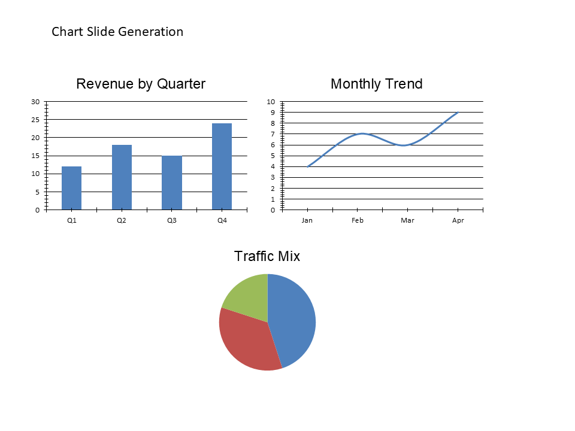

# I05 - Chart Slide Generation

**Focus:** Create bar, line, or pie charts from data.

**Go code**

```go
package main

import (
	"github.com/djinn-soul/gopptx/pkg/pptx"
	"github.com/djinn-soul/gopptx/pkg/pptx/charts"
)

func main() {
	pres := pptx.NewPresentationBuilder("I05 Chart Slide")

	chart := charts.NewBarChart(
		[]string{"Q1", "Q2", "Q3", "Q4"},
		[]float64{150000, 180000, 220000, 290000},
	).WithTitle("Quarterly Revenue")

	slide := pptx.NewSlide("Chart Slide").WithChart(chart)
	pres.AddSlide(slide)

	_ = pres.WriteToFile("i05-go.pptx")
}
```

**Python code**

```python
from gopptx import ChartType, Inches, Presentation

with Presentation.new("I05 Chart Slide") as p:
    slide = p.add_slide("Chart Slide")
    p.add_chart(
        slide.index,
        ChartType.COLUMN,
        ["Q1", "Q2", "Q3", "Q4"],
        [150000, 180000, 220000, 290000],
        title="Quarterly Revenue",
        bounds=(Inches(0.8), Inches(1.6), Inches(8.0), Inches(4.4)),
    )
    p.save("docs/assets/pptx/usage/i05-python.pptx")
```

**Download PPTX:** [i05-python.pptx](../../../assets/pptx/usage/i05-python.pptx)

Screenshot generated from the Python code above using `export_pptx_png.ps1`.


