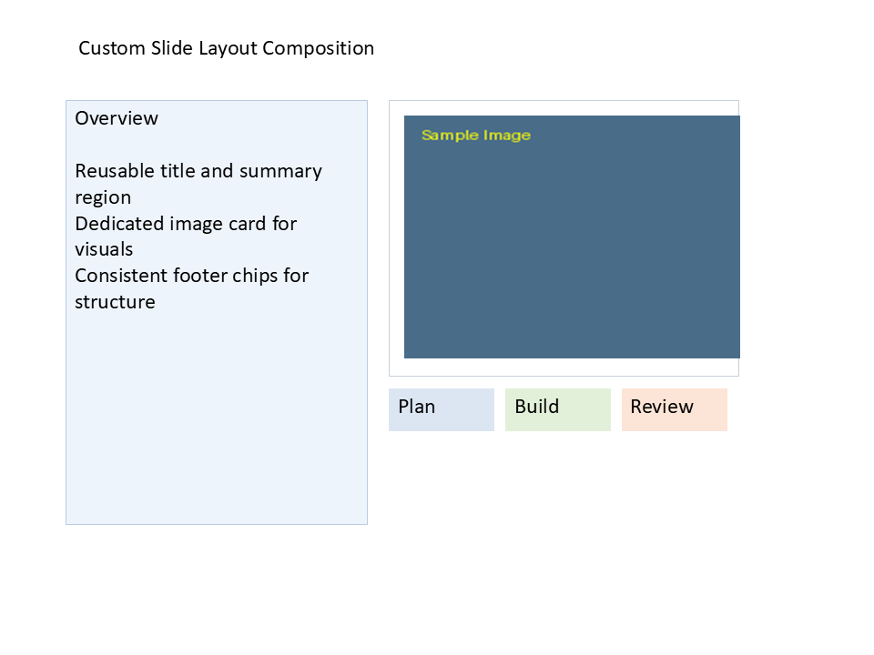

# I06 - Custom Slide Layout Composition

**Focus:** Create and apply custom slide layouts.

**Go code**

```go
package main

import "github.com/djinn-soul/gopptx/pkg/pptx"

func main() {
	pres := pptx.NewPresentationBuilder("I06 Custom Layout")

	layout := pptx.NewSlideLayout("Custom Title - Content").
		AddTitlePlaceholder(pptx.Inches(0.8), pptx.Inches(0.35), pptx.Inches(8.5), pptx.Inches(0.6)).
		AddContentPlaceholder(pptx.Inches(0.8), pptx.Inches(1.2), pptx.Inches(8.5), pptx.Inches(4.5))

	pres.AddSlideLayout(layout)
	pres.AddSlide(pptx.NewSlide("Custom Layout Content"))

	_ = pres.WriteToFile("i06-go.pptx")
}
```

**Python code**

```python
from gopptx import Presentation
from gopptx.schemas import Inches

with Presentation.new("I06 Custom Layout") as p:
    p.add_slide("Custom Layout Content", layout="title - content")
    p.save("docs/assets/pptx/usage/i06-python.pptx")
```

**Download PPTX:** [i06-python.pptx](../../../assets/pptx/usage/i06-python.pptx)

Screenshot generated from the Python code above using `export_pptx_png.ps1`.


