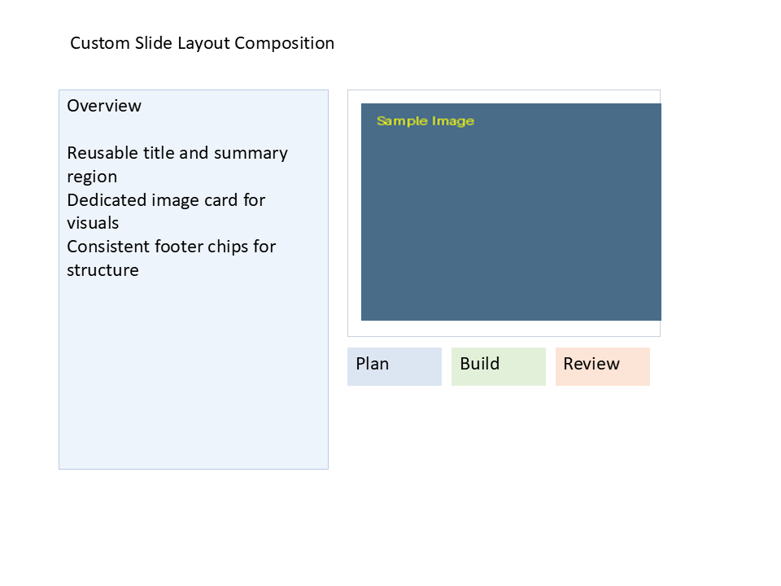

# I06 - Custom Slide Layout Composition

**Focus:** Create and apply custom slide layouts.

**Go code**

```go
package main

import (
	"github.com/djinn-soul/gopptx/pkg/pptx"
	"github.com/djinn-soul/gopptx/pkg/pptx/shapes"
)

func main() {
	// Compose the slide directly: pick a built-in layout, then place the
	// content where you want it. Placeholder overrides adjust an inherited
	// placeholder without authoring a new layout part.
	slide := pptx.NewSlideBuilder("Custom Layout Content")
	slide.WithLayout("title_and_content")
	slide.WithPlaceholderText(1, "Composed body content")
	slide.AddShape(
		shapes.NewRectangle(0.8, 4.6, 8.5, 1.2).
			WithText("An extra band below the content placeholder").
			WithFill(shapes.NewShapeFill("DCE6F2")),
	)

	err := pptx.NewPresentationBuilder("I06 Custom Layout").
		AddSlide(slide.Build()).
		WriteToFile("i06-go.pptx")
	if err != nil {
		panic(err)
	}
}
```

**Python code**

```python
from gopptx import Presentation, SlideLayoutType

# Layouts are selected with SlideLayoutType constants, not strings.
# Available: BLANK, TITLE_ONLY, CENTERED_TITLE, TITLE_AND_CONTENT.
with Presentation.new("I06 Custom Layout") as p:
    p.add_slide("Custom Layout Content", layout=SlideLayoutType.TITLE_AND_CONTENT)
    p.save("docs/assets/pptx/usage/i06-python.pptx")
```

**Download PPTX:** [i06-python.pptx](../../../assets/pptx/usage/i06-python.pptx)

Screenshot generated from the Python code above using `export_pptx_png.ps1`.


