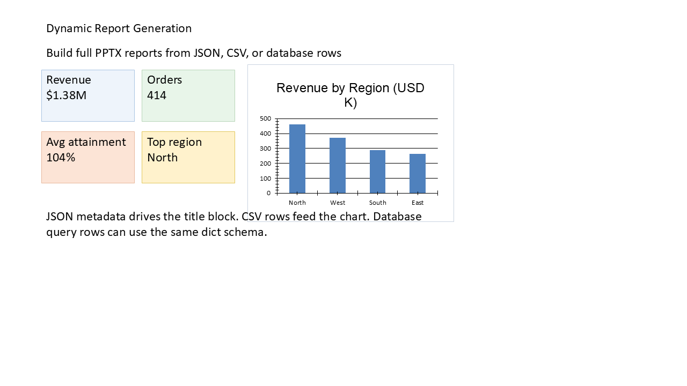

# I08 - Dynamic Report Generation

**Focus:** Generate reports from data sources dynamically.

**Go code**

```go
package main

import (
	"github.com/djinn-soul/gopptx/pkg/pptx"
)

type Metrics struct {
	Name  string
	Value int
	Unit  string
}

func main() {
	metrics := []Metrics{
		{"Revenue", 1250000, "USD"},
		{"Users", 45000, "count"},
		{"Conversion", 3.2, "%"},
	}

	pres := pptx.NewPresentationBuilder("I08 Dynamic Report")
	slide := pptx.NewSlide("Dynamic Report")

	for _, m := range metrics {
		slide.AddBullet(m.Name + ": " + string(rune(m.Value)) + " " + m.Unit)
	}

	pres.AddSlide(slide)
	_ = pres.WriteToFile("i08-go.pptx")
}
```

**Python code**

```python
from gopptx import Presentation

metrics = [
    {"name": "Revenue", "value": 1250000, "unit": "USD"},
    {"name": "Users", "value": 45000, "unit": "count"},
    {"name": "Conversion", "value": 3.2, "unit": "%"},
]

with Presentation.new("I08 Dynamic Report") as p:
    p.add_slide("Dynamic Report")
    text = "\n".join(f"{m['name']}: {m['value']:,} {m['unit']}" for m in metrics)
    p.slides[0].add_textbox(0.8, 2.0, 8.0, 3.0, text=text)
    p.save("docs/assets/pptx/usage/i08-python.pptx")
```

**Download PPTX:** [i08-python.pptx](../../../assets/pptx/usage/i08-python.pptx)

Screenshot generated from the Python code above using `export_pptx_png.ps1`.


