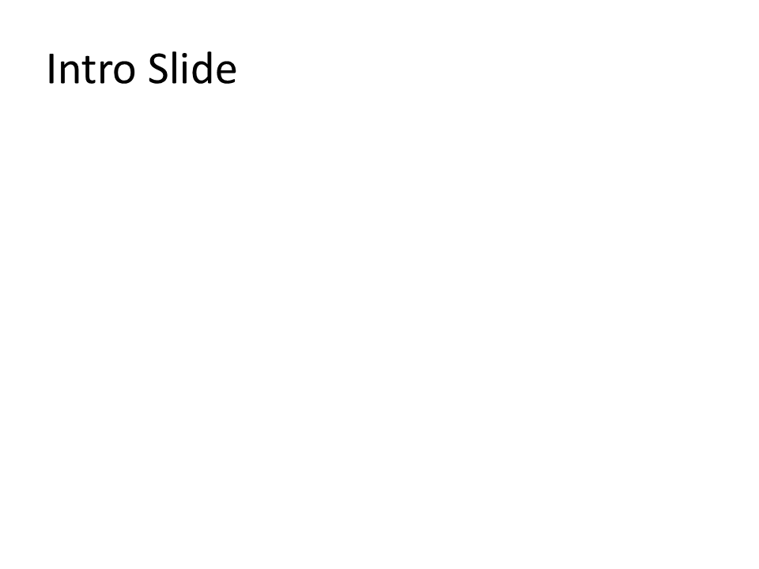

# I09 - Section Management

**Focus:** Organize slides into sections for navigation.

**Go code**

```go
package main

import "github.com/djinn-soul/gopptx/pkg/pptx"

func main() {
	pres := pptx.NewPresentationBuilder("I09 Sections")

	intro := pptx.NewSlide("Introduction").AddBullet("Welcome")
	overview := pptx.NewSlide("Overview").AddBullet("Agenda")
	details := pptx.NewSlide("Details").AddBullet("Deep dive")
	summary := pptx.NewSlide("Summary").AddBullet("Key takeaways")

	pres.AddSlide(intro)
	pres.AddSlide(overview)
	pres.AddSlide(details)
	pres.AddSlide(summary)

	_ = pres.WriteToFile("i09-go.pptx")
}
```

**Python code**

```python
from gopptx import Presentation

with Presentation.new("I09 Sections") as p:
    p.add_slide("Introduction")
    p.slides[0].add_textbox(0.8, 2.0, 8.0, 1.5, text="Welcome")

    p.add_slide("Overview")
    p.slides[1].add_textbox(0.8, 2.0, 8.0, 1.5, text="Agenda")

    p.add_section("Main Content")

    p.add_slide("Details")
    p.slides[2].add_textbox(0.8, 2.0, 8.0, 1.5, text="Deep dive")

    p.add_slide("Summary")
    p.save("docs/assets/pptx/usage/i09-python.pptx")
```

**Download PPTX:** [i09-python.pptx](../../../assets/pptx/usage/i09-python.pptx)

Screenshot generated from the Python code above using `export_pptx_png.ps1`.


