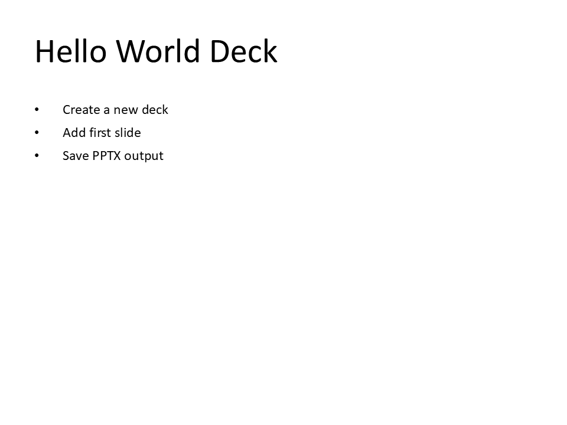
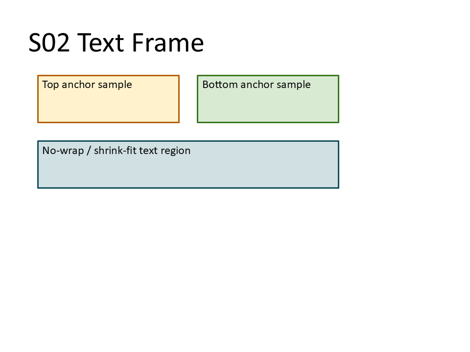
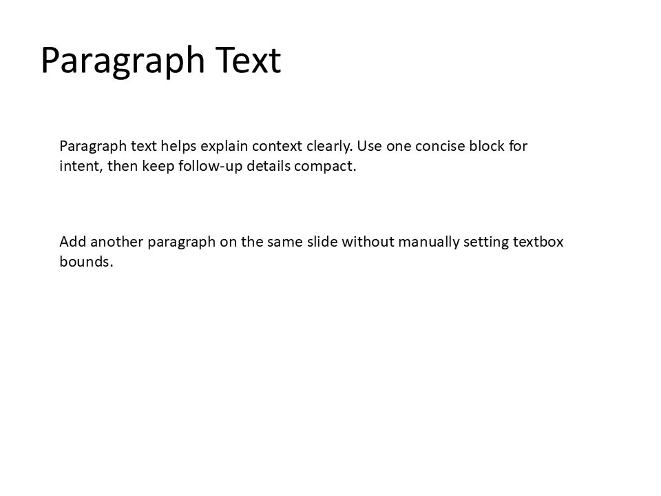
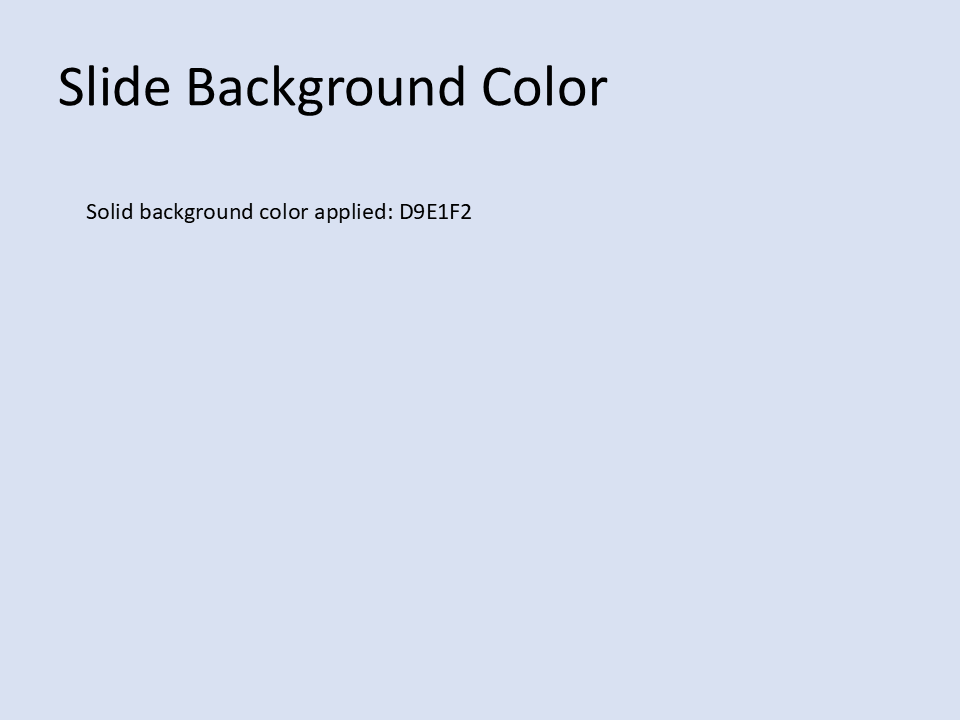
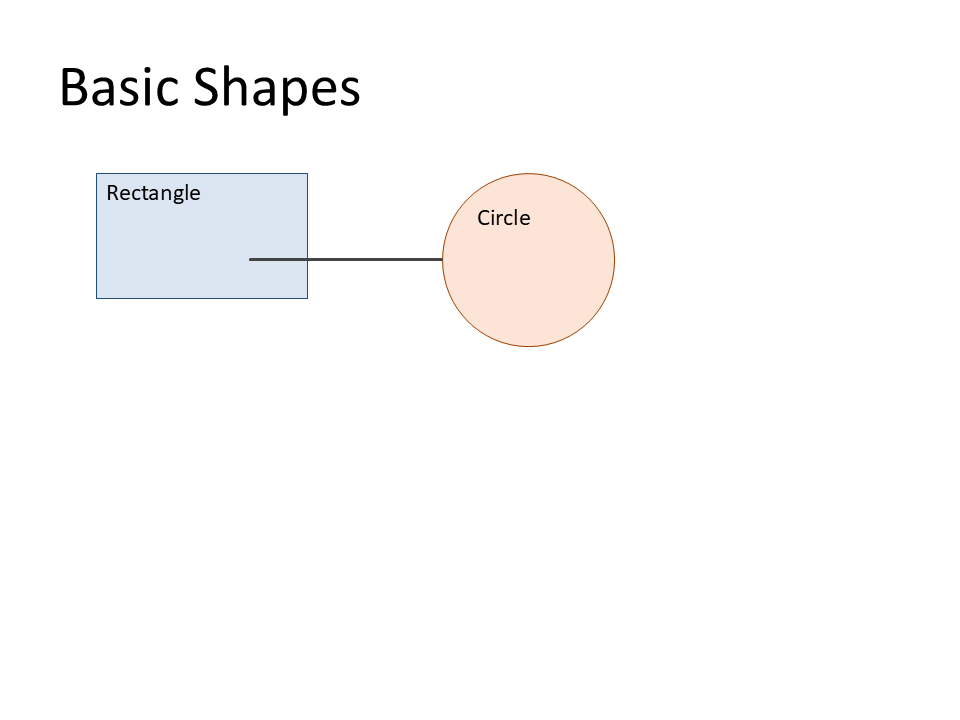
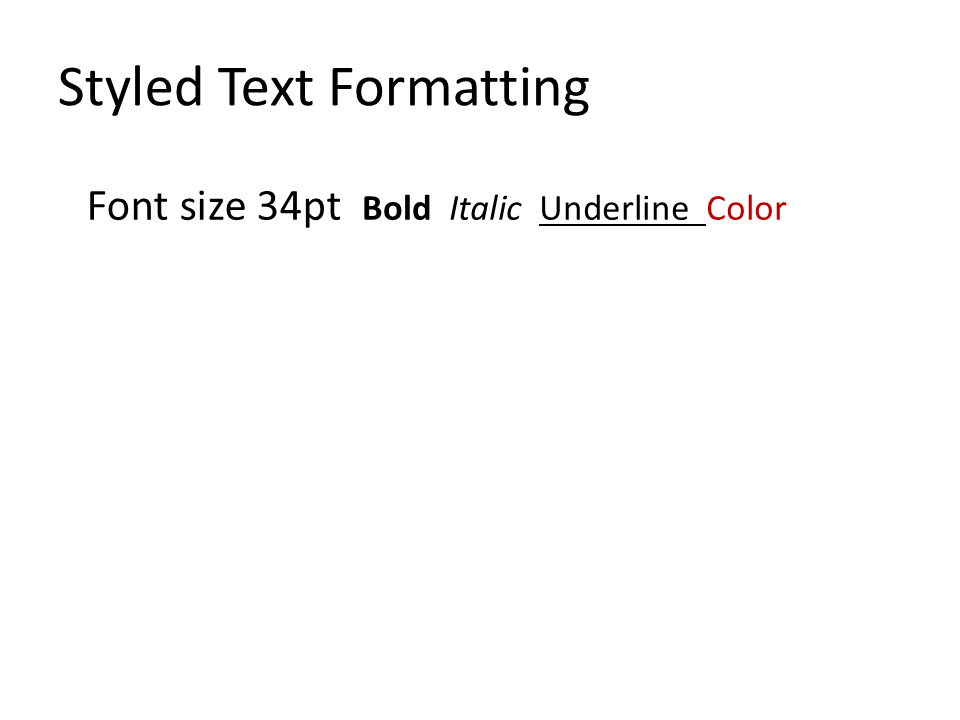
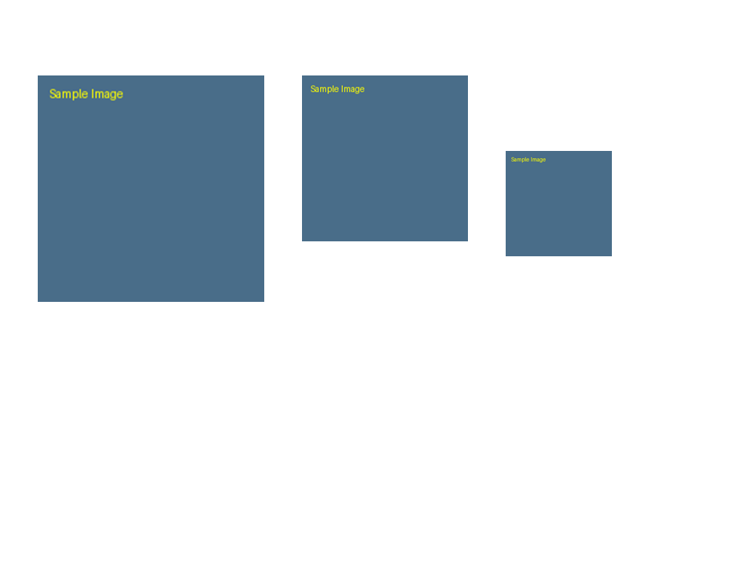
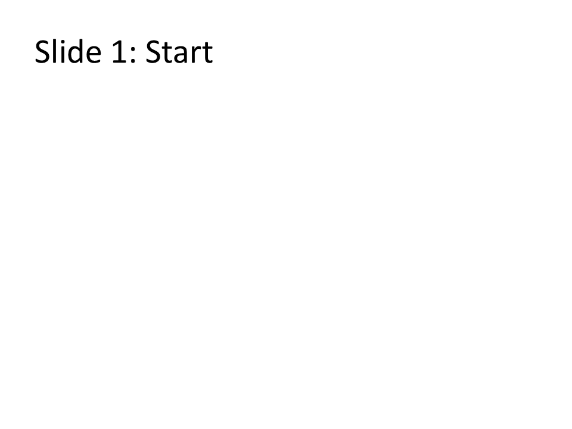

# Simple Usages (10)

Start here for first-time adoption and foundational slide automation.

Each usage is code-first and screenshot is generated from that Python code.

## S01 - Hello World Deck

**Focus:** Create first slide and save.

**Go code**

```go
package main

import "github.com/djinn-soul/gopptx/pkg/gopptx"

func main() {
	pres := &gopptx.Presentation{Title: "S01 Hello World"}
	slide := pres.AddSlide()
	slide.Title = "Hello World Deck"
	slide.AddBullet("Create a new deck")
	slide.AddBullet("Add first slide")
	slide.AddBullet("Save PPTX output")
	_ = pres.Save("s01-go.pptx")
}
```

**Python code**

```python
from gopptx import Presentation

with Presentation.new("S01 Hello World") as p:
    p.add_bullet_slide(
        "Hello World Deck",
        [
            "Create a new deck",
            "Add first slide",
            "Save PPTX output",
        ],
    )
    p.save("docs/assets/pptx/usage/s01-python.pptx")
```

**Download PPTX:** [s01-python.pptx](../../assets/pptx/usage/s01-python.pptx)

Screenshot generated from the Python code above using `export_pptx_png.ps1`.



## S02 - Basic Text Frame

**Focus:** Add controlled text regions.

**Go code**

```go
package main

import (
	"github.com/djinn-soul/gopptx/pkg/gopptx"
	"github.com/djinn-soul/gopptx/pkg/pptx/shapes"
)

func main() {
	pres := &gopptx.Presentation{Title: "S02 Text Frame"}
	slide := pres.AddSlide()
	slide.Title = "Basic Text Frame"
	slide.AddShape(shapes.NewRectangle(0.8, 2.0, 3.0, 1.0).WithText("Top anchor sample"))
	slide.AddShape(shapes.NewRectangle(4.4, 2.0, 3.0, 1.0).WithText("Bottom anchor sample"))
	slide.AddShape(shapes.NewRectangle(0.8, 3.3, 6.6, 1.0).WithText("No-wrap / shrink-fit text region"))
	_ = pres.Save("s02-go.pptx")
}
```

**Python code**

```python
from gopptx import Presentation
from gopptx.schemas import Inches, Point

with Presentation.new("S02 Text Frame") as p:
    p.add_slide("Basic Text Frame")
    p.add_shape(
        0,
        "rect",
        (Inches(0.8), Inches(1.6), Inches(3.0), Inches(1.0)),
        text="Top anchor sample",
        properties={"fill": {"solid": "FFF2CC"}, "line": {"color": "B45F06", "width_emu": Point(2)}},
    )
    p.add_shape(
        0,
        "rect",
        (Inches(4.2), Inches(1.6), Inches(3.0), Inches(1.0)),
        text="Bottom anchor sample",
        properties={"fill": {"solid": "D9EAD3"}, "line": {"color": "38761D", "width_emu": Point(2)}},
    )
    p.add_shape(
        0,
        "rect",
        (Inches(0.8), Inches(3.0), Inches(6.4), Inches(1.0)),
        text="No-wrap / shrink-fit text region",
        properties={"fill": {"solid": "D0E0E3"}, "line": {"color": "134F5C", "width_emu": Point(2)}},
    )
    p.save("docs/assets/pptx/usage/s02-python.pptx")
```

**Download PPTX:** [s02-python.pptx](../../assets/pptx/usage/s02-python.pptx)

Screenshot generated from the Python code above using `export_pptx_png.ps1`.



## S03 - Paragraph Text

**Focus:** Add a readable paragraph text block.

**Go code**

```go
package main

import "github.com/djinn-soul/gopptx/pkg/pptx"

func main() {
	builder := pptx.NewPresentationBuilder("S03 Paragraph Text")
	s := pptx.NewSlide("Paragraph Text").
		AddShape(
			pptx.NewTextBox(
				"Paragraph text helps explain context clearly. "+
					"Use one concise block for intent, then keep follow-up details compact.",
				0.8, 2.0, 8.0, 2.2,
			),
		).
		AddShape(
			pptx.NewTextBox(
				"Add another paragraph on the same slide using a second text box block.",
				0.8, 4.5, 8.0, 1.0,
			),
		)
	_ = builder.AddSlide(s).WriteToFile("s03-go.pptx")
}
```

**Python code**

```python
from gopptx import Presentation

with Presentation.new("S03 Paragraph Text") as p:
    slide = p.add_paragraph_slide(
        "Paragraph Text",
        (
            "Paragraph text helps explain context clearly. "
            "Use one concise block for intent, then keep follow-up details compact."
        ),
    )
    slide.add_paragraph(
        "Add another paragraph on the same slide without manually setting textbox bounds."
    )
    p.save("docs/assets/pptx/usage/s03-python.pptx")
```

**Download PPTX:** [s03-python.pptx](../../assets/pptx/usage/s03-python.pptx)

Screenshot generated from the Python code above using `export_pptx_png.ps1`.



## S04 - Insert an Image

**Focus:** Add a PNG/JPG image to a slide.

**Go code**

```go
package main

import (
	"github.com/djinn-soul/gopptx/pkg/gopptx"
	"github.com/djinn-soul/gopptx/pkg/pptx/shapes"
	"github.com/djinn-soul/gopptx/pkg/pptx/styling"
)

func main() {
	pres := &gopptx.Presentation{Title: "S04 Insert an Image"}
	slide := pres.AddSlide()
	slide.Title = "Insert an Image"
	slide.AddImage(
		shapes.NewImage(
			"examples/assets/55/repository-open-graph-template.png",
			styling.Inches(0.8),
			styling.Inches(1.4),
			styling.Inches(8.0),
			styling.Inches(4.6),
		).WithAltText("Inserted PNG sample"),
	)
	_ = pres.Save("s04-go.pptx")
}
```

**Python code**

```python
from gopptx import Presentation
from gopptx.constants import ConnectorType, ShapeType
from gopptx.schemas import Inches

with Presentation.new("S04 Insert an Image") as p:
    p.add_image(
        0,
        "examples/assets/55/repository-open-graph-template.png",
        (Inches(0.8), Inches(1.4), Inches(8.0), Inches(4.6)),
    )
    p.save("docs/assets/pptx/usage/s04-python.pptx")
```

**Download PPTX:** [s04-python.pptx](../../assets/pptx/usage/s04-python.pptx)

Screenshot generated from the Python code above using `export_pptx_png.ps1`.


## S05 - Set Slide Background Color

**Focus:** Apply a solid background color.

**Go code**

```go
package main

import (
	"os"

	"github.com/djinn-soul/gopptx/pkg/pptx"
)

func main() {
	slide := pptx.NewSlide("Slide Background Color").
		WithBackgroundColor("D9E1F2").
		AddBullet("Apply a solid background color.").
		AddBullet("Keep title and content readable.").
		AddBullet("Save as PPTX.")

	data, err := pptx.CreateWithSlides("S05 Set Slide Background Color", []pptx.SlideContent{slide})
	if err != nil {
		panic(err)
	}
	_ = os.WriteFile("s05-go.pptx", data, 0o600)
}
```

**Python code**

```python
from gopptx import Presentation
from gopptx.constants import ConnectorType, ShapeType
from gopptx.schemas import Inches

with Presentation.new("S05 Set Slide Background Color") as p:
    slide = p.slides[0]
    slide.title = "Slide Background Color"
    slide.set_background("solid", color="D9E1F2")
    slide.add_textbox(
        Inches(0.8),
        Inches(2.0),
        Inches(8.0),
        Inches(1.6),
        text="Solid background color applied: D9E1F2",
    )
    p.save("docs/assets/pptx/usage/s05-python.pptx")
```

**Download PPTX:** [s05-python.pptx](../../assets/pptx/usage/s05-python.pptx)

Screenshot generated from the Python code above using `export_pptx_png.ps1`.



## S06 - Add Basic Shapes

**Focus:** Insert rectangle, circle, and line shapes.

**Go code**

```go
package main

import (
	"github.com/djinn-soul/gopptx/pkg/gopptx"
	"github.com/djinn-soul/gopptx/pkg/pptx/shapes"
	"github.com/djinn-soul/gopptx/pkg/pptx/styling"
)

func main() {
	pres := &gopptx.Presentation{Title: "S06 Add Basic Shapes"}
	slide := pres.AddSlide()
	slide.Title = "Basic Shapes"
	slide.AddShape(
		shapes.NewRectangle(1.0, 1.8, 2.2, 1.3).
			WithText("Rectangle").
			WithFill(shapes.NewShapeFill("DCE6F2")).
			WithLine(shapes.NewShapeLine("1F4E78", styling.Points(1))),
	)
	slide.AddShape(
		shapes.NewEllipse(4.6, 1.8, 1.8, 1.8).
			WithText("Circle").
			WithFill(shapes.NewShapeFill("FCE4D6")).
			WithLine(shapes.NewShapeLine("9C3F00", styling.Points(1))),
	)
	slide.AddConnector(
		shapes.NewStraightConnector(
			styling.Inches(2.6),
			styling.Inches(2.7),
			styling.Inches(4.6),
			styling.Inches(2.7),
		).WithLine(shapes.NewShapeLine("444444", styling.Points(1.5))),
	)
	_ = pres.Save("s06-go.pptx")
}
```

**Python code**

```python
from gopptx import Presentation
from gopptx.constants import ShapeType
from gopptx.schemas import Inches

with Presentation.new("S06 Add Basic Shapes") as p:
    slide = p.slides[0]
    slide.title = "Basic Shapes"
    slide.add_shape(
        ShapeType.RECTANGLE,
        (Inches(1.0), Inches(1.8), Inches(2.2), Inches(1.3)),
        text="Rectangle",
        properties={
            "fill": {"solid": "DCE6F2"},
            "line": {"color": "1F4E78", "width_emu": 12700},
        },
    )
    slide.add_shape(
        ShapeType.ELLIPSE,
        (Inches(4.6), Inches(1.8), Inches(1.8), Inches(1.8)),
        text="Circle",
        properties={
            "fill": {"solid": "FCE4D6"},
            "line": {"color": "9C3F00", "width_emu": 12700},
        },
    )
    slide.add_connector(
        ConnectorType.STRAIGHT,
        Inches(2.6),
        Inches(2.7),
        Inches(4.6),
        Inches(2.7),
        properties={"line": {"color": "444444", "width_emu": 19050}},
    )
    p.save("docs/assets/pptx/usage/s06-python.pptx")
```

**Download PPTX:** [s06-python.pptx](../../assets/pptx/usage/s06-python.pptx)

Screenshot generated from the Python code above using `export_pptx_png.ps1`.



## S07 - Styled Text Formatting

**Focus:** Use font size, bold, italic, underline, and color.

**Go code**

```go
package main

import "github.com/djinn-soul/gopptx/pkg/pptx"

func main() {
	slide := pptx.NewSlide("Styled Text Formatting").
		WithTitleColor("1F4E79").
		WithTitleBold(true).
		WithTitleItalic(true).
		WithContentSize(22).
		WithContentBold(true).
		WithContentItalic(true).
		WithContentUnderline(true).
		WithContentColor("C00000").
		AddBullet("Formatted bullet content")

	_ = pptx.NewPresentationBuilder("S07 Styled Text Formatting").
		AddSlide(slide).
		WriteToFile("s07-go.pptx")
}
```

**Python code**

```python
from gopptx import Presentation
from gopptx.schemas import Inches

with Presentation.new("S07 Styled Text Formatting") as p:
    slide = p.add_slide("Styled Text Formatting")
    slide.add_textbox(
        Inches(0.8),
        Inches(1.8),
        Inches(8.0),
        Inches(2.0),
        runs=[
            {"text": "Font size 34pt  ", "size_pt": 34},
            {"text": "Bold  ", "bold": True, "size_pt": 28},
            {"text": "Italic  ", "italic": True, "size_pt": 28},
            {"text": "Underline  ", "underline": "sng", "size_pt": 28},
            {"text": "Color", "color": "C00000", "size_pt": 28},
        ],
    )
    p.save("docs/assets/pptx/usage/s07-python.pptx")
```

**Download PPTX:** [s07-python.pptx](../../assets/pptx/usage/s07-python.pptx)

Screenshot generated from the Python code above using `export_pptx_png.ps1`.



## S08 - Create a Blank Presentation

**Focus:** Start a new PPTX file and save it without visible slide content.

**Go code**

```go
package main

import "github.com/djinn-soul/gopptx/pkg/pptx"

func main() {
	_ = pptx.NewPresentationBuilder("Blank Presentation").
		AddSlide(
			pptx.NewSlide("").WithBlankLayout(),
		).
		WriteToFile("s08-go.pptx")
}
```

**Python code**

```python
from gopptx import Presentation

with Presentation.new("Blank Presentation") as p:
    p.add_slide("", layout="blank")
    p.remove_slide(0)
    p.save("docs/assets/pptx/usage/s08-python.pptx")
```

**Download PPTX:** [s08-python.pptx](../../assets/pptx/usage/s08-python.pptx)

Screenshot generated from the Python code above using `export_pptx_png.ps1`.


## S09 - Image Positioning and Scaling

**Focus:** Resize and place images precisely.

**Go code**

```go
package main

import (
	"github.com/djinn-soul/gopptx/pkg/gopptx"
	"github.com/djinn-soul/gopptx/pkg/pptx/shapes"
	"github.com/djinn-soul/gopptx/pkg/pptx/styling"
)

func main() {
	pres := &gopptx.Presentation{Title: "S09 Image Positioning and Scaling"}
	slide := pres.AddSlide()
	slide.Layout = "blank"
	slide.AddImage(
		shapes.NewImage(
			"examples/assets/test_image.png",
			styling.Inches(0.5),
			styling.Inches(1.0),
			styling.Inches(3.0),
			styling.Inches(3.0),
		),
	)
	slide.AddImage(
		shapes.NewImage(
			"examples/assets/test_image.png",
			styling.Inches(4.0),
			styling.Inches(1.0),
			styling.Inches(2.2),
			styling.Inches(2.2),
		),
	)
	slide.AddImage(
		shapes.NewImage(
			"examples/assets/test_image.png",
			styling.Inches(6.7),
			styling.Inches(2.0),
			styling.Inches(1.4),
			styling.Inches(1.4),
		),
	)
	_ = pres.Save("s09-go.pptx")
}
```

**Python code**

```python
from gopptx import Presentation
from gopptx.schemas import Inches

with Presentation.new("S09 Image Positioning and Scaling") as p:
    p.update_slide(0, layout="blank")
    slide = p.slides[0]
    slide.add_image(
        "examples/assets/test_image.png",
        (Inches(0.5), Inches(1.0), Inches(3.0), Inches(3.0)),
    )
    slide.add_image(
        "examples/assets/test_image.png",
        (Inches(4.0), Inches(1.0), Inches(2.2), Inches(2.2)),
    )
    slide.add_image(
        "examples/assets/test_image.png",
        (Inches(6.7), Inches(2.0), Inches(1.4), Inches(1.4)),
    )
    p.save("docs/assets/pptx/usage/s09-python.pptx")
```

**Download PPTX:** [s09-python.pptx](../../assets/pptx/usage/s09-python.pptx)

Screenshot generated from the Python code above using `export_pptx_png.ps1`.



## S10 - Slide Transitions

**Focus:** Apply visual transitions between slides (Fade, Morph, etc.).

**Go code**

```go
package main

import (
	"github.com/djinn-soul/gopptx/pkg/gopptx"
	"github.com/djinn-soul/gopptx/pkg/pptx"
)

func main() {
	pres := &gopptx.Presentation{Title: "S10 Slide Transitions"}
	pres.AddSlide().Title = "Slide 1: Start"
	
	slide2 := pres.AddSlide()
	slide2.Title = "Slide 2: Fade Entry"
	slide2.SetTransition(pptx.TransitionFade, 1000)
	
	_ = pres.Save("s10-go.pptx")
}
```

**Python code**

```python
from gopptx import Presentation
from gopptx.transitions import TRANSITION_FADE

with Presentation.new("S10 Slide Transitions") as p:
    p.add_slide("Slide 1: Start")
    slide2 = p.add_slide("Slide 2: Fade Entry")
    slide2.set_transition(TRANSITION_FADE, duration_ms=1000)
    p.save("docs/assets/pptx/usage/s10-python.pptx")
```

**Download PPTX:** [s10-python.pptx](../../assets/pptx/usage/s10-python.pptx)

Screenshot generated from the Python code above using `export_pptx_png.ps1`.



