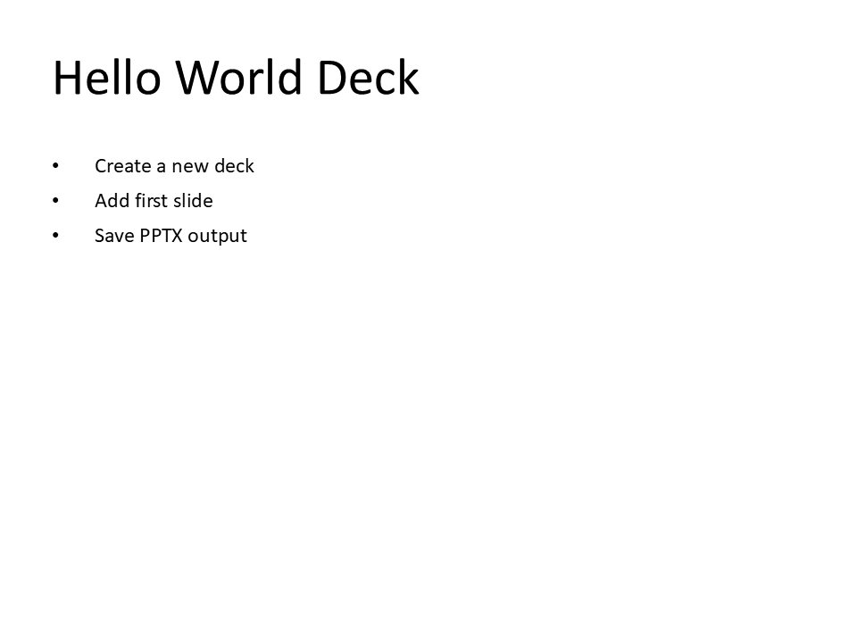

# S01 - Hello World Deck

**Focus:** Create first slide and save.

**Go code**

```go
package main

import "github.com/djinn-soul/gopptx/pkg/pptx"

func main() {
	slide := pptx.NewSlideBuilder("Hello World Deck")
	slide.AddBullet("Create a new deck")
	slide.AddBullet("Add first slide")
	slide.AddBullet("Save PPTX output")

	err := pptx.NewPresentationBuilder("S01 Hello World").
		AddSlide(slide.Build()).
		WriteToFile("s01-go.pptx")
	if err != nil {
		panic(err)
	}
}
```

**Python code**

```python
from gopptx import Presentation

with Presentation.new("S01 Hello World") as p:
    p.add_bullet_slide(
        "Hello World Deck",
        [
            "Create a new deck",
            "Add first slide",
            "Save PPTX output",
        ],
    )
    p.save("docs/assets/pptx/usage/s01-python.pptx")
```

**Download PPTX:** [s01-python.pptx](../../../assets/pptx/usage/s01-python.pptx)

Screenshot generated from the Python code above using `export_pptx_png.ps1`.


