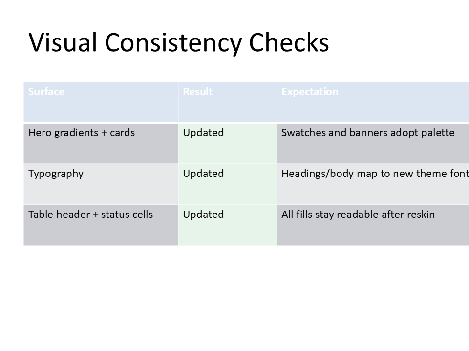

# Dynamic Brand Reskinning

Apply different brand themes to the same presentation content without rebuilding slides manually.

## Typical Use Case

- agency creates one base deck template
- same content is exported for multiple client brands
- theme, logo, and accent colors are swapped programmatically

## Go Example Entry Point

```bash
go run ./examples/43-presentation-props-editor/main.go
```

## Artifacts

- Source: `examples/43-presentation-props-editor/main.go`
- PPTX: [brand-reskin.pptx](../assets/pptx/brand-reskin.pptx)
- Screenshot:


