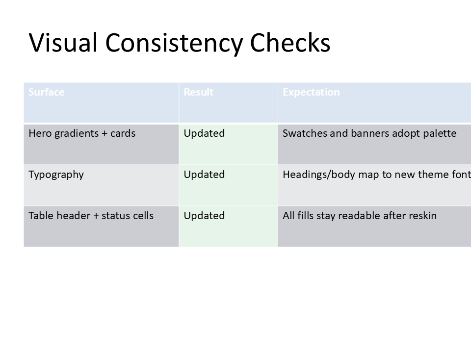

# Brand Reskinning

Apply different brand themes to the same presentation content.

## Workflow

1. Create one base deck template.
2. Swap theme, logo, and accent colors.
3. Export the same content for each brand.

The point is that the content never changes. You open the same deck once per brand, swap the
theme, colours and logo, and write a differently-branded copy — no re-layout, no duplicated
source of truth.

## Python

```python
from gopptx import Presentation

BRANDS = {
    "acme":   {"accent1": "1F4E78", "accent2": "2E7D32", "logo": "brand/acme.png"},
    "globex": {"accent1": "7B1FA2", "accent2": "F57C00", "logo": "brand/globex.png"},
}

for name, brand in BRANDS.items():
    with Presentation("base-deck.pptx") as pres:
        pres.set_theme_color_scheme(accent1=brand["accent1"], accent2=brand["accent2"])
        pres.set_theme_font_scheme("Segoe UI", "Segoe UI")

        # Replace the logo in place — geometry and z-order are preserved.
        for image in pres.list_slide_images(0):
            with open(brand["logo"], "rb") as fh:
                pres.swap_image_by_rel_id(0, image["rel_id"], fh.read(), "png")
            break

        pres.set_core_properties({"creator": name, "title": f"{name} Overview"})
        pres.save(f"deck-{name}.pptx")
```

`swap_image_by_rel_id` and `swap_image_by_index` replace the bytes behind an existing picture,
so the new logo lands exactly where the old one sat. That is what makes reskinning cheap.

## Go

```bash
go run ./examples/43-presentation-props-editor
go run ./examples/43-advanced-theme-management
```

## Artifacts

- Source: `examples/43-presentation-props-editor/main.go`
- PPTX: [brand-reskin.pptx](../assets/pptx/brand-reskin.pptx)
- Screenshot: 
