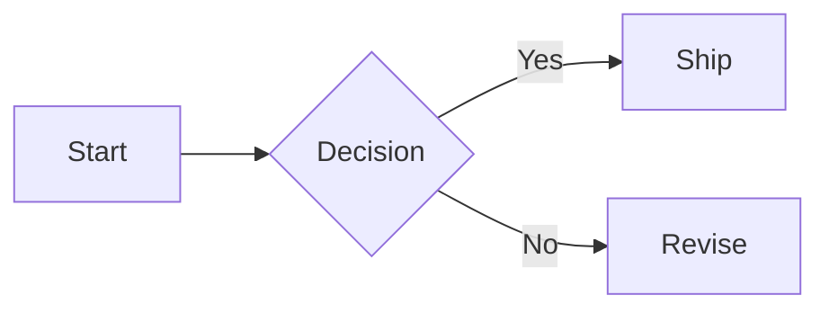
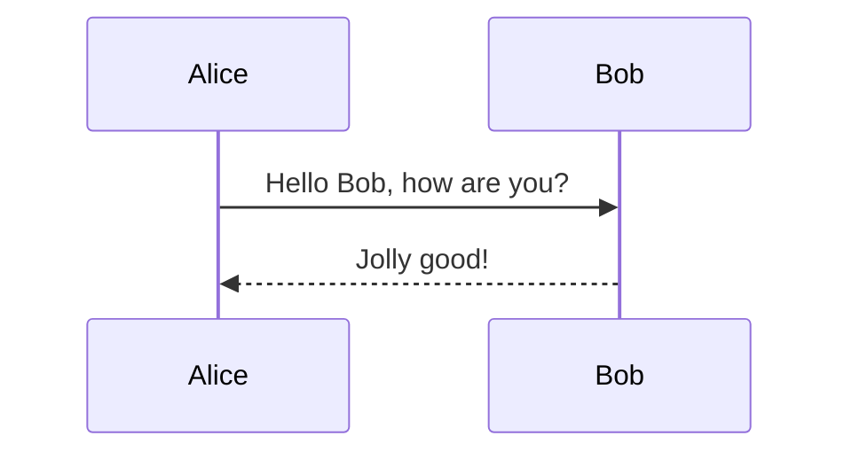
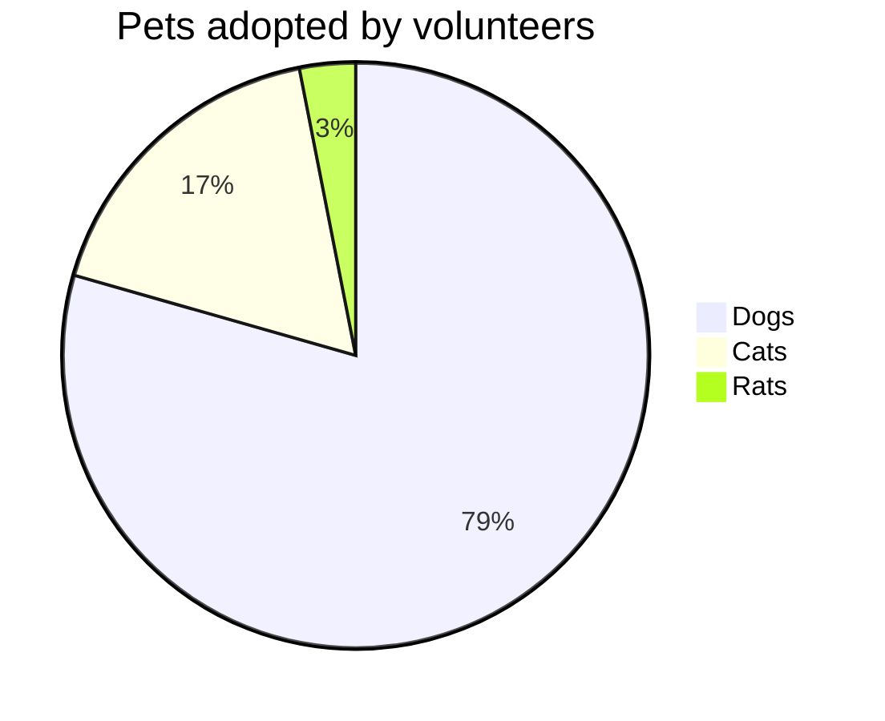
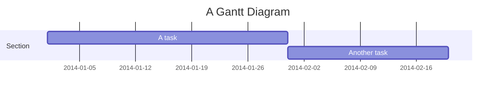
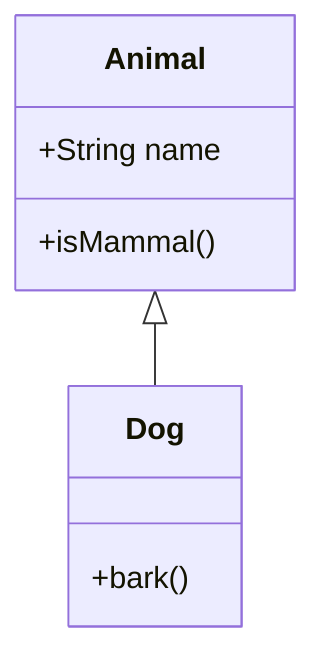
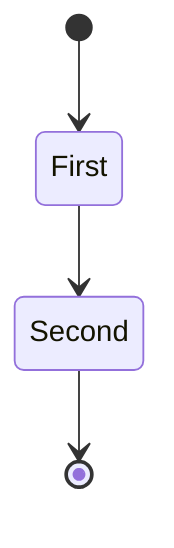
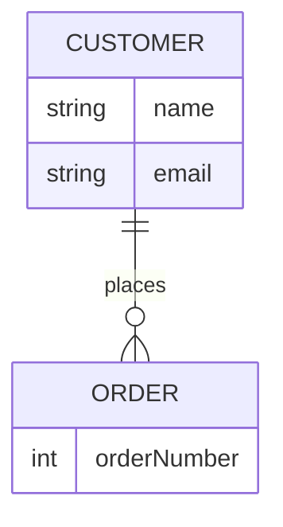
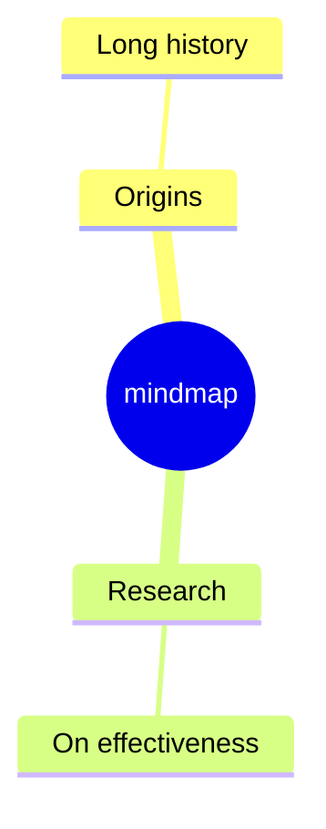
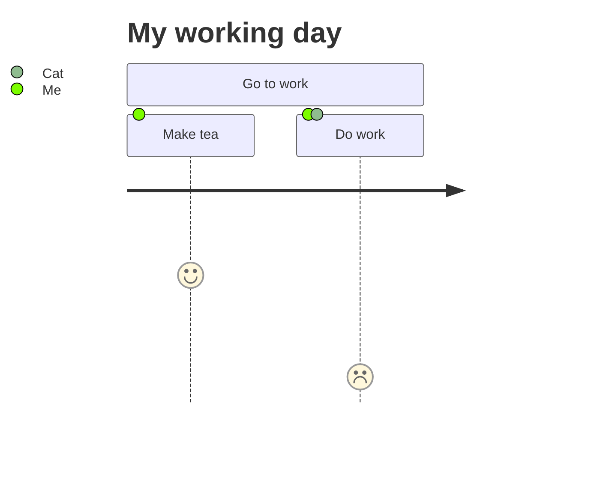
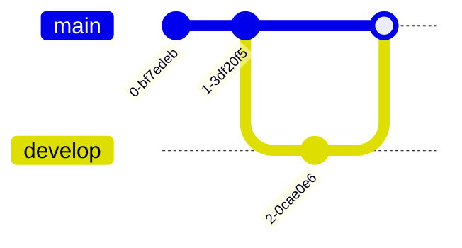

# Markdown To PPTX To Native PDF
- Complex markdown deck with many mermaid diagrams
- Generated through task example: 03-markdown-to-pptx
- Output artifacts:
  - 03_markdown_mermaid_complex.md
  - 03_markdown_mermaid_complex.pptx
  - 03_markdown_mermaid_complex.pdf

---

# Mermaid: Flowchart


---

# Mermaid: Sequence


---

# Mermaid: Pie


---

# Mermaid: Gantt


---

# Mermaid: Timeline


---

# Mermaid: Quadrant


---

# Mermaid: Class


---

# Mermaid: State


---

# Mermaid: ER


---

# Mermaid: Mindmap


---

# Mermaid: Journey


---

# Mermaid: GitGraph


---

# Verification Checklist
| Step | Status |
|---|---|
| Markdown parsed | PASS |
| PPTX generated | PASS |
| Native PDF exported | PASS |

```go
slides, err := pptx.SlidesFromMarkdown(markdown)
if err != nil { return err }
err = export.PDFWithOptions("Deck", slides, "out.pdf",
  export.PDFOptions{Driver: export.PDFDriverNative})
```
